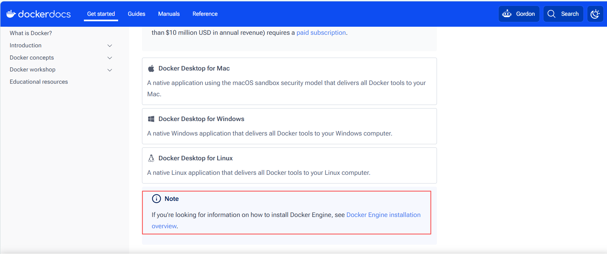

docker 官网: https://www.docker.com/

docker desktop ubuntu 安装文档: https://docs.docker.com/desktop/setup/install/linux/ubuntu/

docker engine ubuntu 安装文档: https://docs.docker.com/engine/install/ubuntu/   (`wsl` 中只需要安装 `docker engine` 即可)




`Docker` 从大版本来说，分为三类：`Moby`、社区版`Docker-CE`（`Community Edition`）和企业版`Docker-EE`（`Enterprise Edition`）;

`Docker` 可以安装在`Windows`、`Linux`、`Mac`等系统中，但生产环境下，服务器使用`Linux`中的`CentOS`居多;

# 1、Docker 安装

## 1.1、安装环境准备

```shell
# 宿主机: win11

# wsl 虚拟机系统
PS C:\Users\he875> wsl -l -v
  NAME            STATE           VERSION
* Ubuntu-24.04    Running         2

# 进入虚拟机，确认当前用户
hewenyu@hewenyu:/mnt/c/Users/he875$ whoami
hewenyu
```

## 1.2、安装前置，卸载冲突的 `docker` 包

在安装 `Docker Engine` 之前，需要卸载所有冲突的软件包，部分linux发行版有可能提供了非官方的 `Docker` 包，有可能与官方包冲突，需要在安装之前卸载它们;

```shell
# 卸载所有冲突包
sudo apt-get remove docker.io docker-compose docker-compose-v2 docker-doc podman-docker containerd runc
```

## 1.3、使用 `apt` 仓库安装

### 1.3.1、设置 `Docker` 的 `apt` 仓库 (`apt`源改成阿里云，参考下一节)

```shell
# 更新包索引并安装必要工具
sudo apt-get update
sudo apt-get install ca-certificates curl

# 创建密钥存放目录
sudo install -m 0755 -d /etc/apt/keyrings

# 下载 Docker 官方 GPG 密钥
sudo curl -fsSL https://download.docker.com/linux/ubuntu/gpg -o /etc/apt/keyrings/docker.asc

# 设置密钥权限（所有人可读）
sudo chmod a+r /etc/apt/keyrings/docker.asc

# 添加 Docker 仓库到 Apt 源
sudo tee /etc/apt/sources.list.d/docker.sources <<EOF
Types: deb
URIs: https://download.docker.com/linux/ubuntu
Suites: $(. /etc/os-release && echo "${UBUNTU_CODENAME:-$VERSION_CODENAME}")
Components: stable
Architectures: $(dpkg --print-architecture)
Signed-By: /etc/apt/keyrings/docker.asc
EOF

# 更新包索引
sudo apt-get update
```

|命令	| 作用|
|--|--|
|`sudo apt-get update`	|刷新本地软件包列表|
|`sudo apt-get install ca-certificates curl`	|安装 CA 证书和 curl，用于安全下载密钥|
|`sudo install -m 0755 -d /etc/apt/keyrings`	|创建目录 /etc/apt/keyrings，权限 0755|
|`sudo curl -fsSL ... -o ...`	|下载 Docker 官方 GPG 密钥并保存为 ASC 文件|
|`sudo chmod a+r ...`	|使密钥文件对所有用户可读|
|`sudo tee ... <<EOF ... EOF`	|使用 Here Document 将多行仓库配置写入 /etc/apt/sources.list.d/docker.sources|
|`$(. /etc/os-release && echo "${UBUNTU_CODENAME:-$VERSION_CODENAME}")`	|自动获取当前 Ubuntu 版本代号（如 noble, jammy）|
|`$(dpkg --print-architecture)`	|自动获取系统架构（如 amd64）|


### 1.3.2、切换 `apt` 源为阿里云地址

`docker` 的 `apt` 镜像源地址默认是国外的，下载比较慢，可以使用 阿里云的镜像下载地址加速

```shell
# 1. 安装必要工具
sudo apt update
sudo apt install ca-certificates curl

# 2. 创建密钥目录
sudo install -m 0755 -d /etc/apt/keyrings

# 3. 下载阿里云的 GPG 密钥（注意 URL 变了）
sudo curl -fsSL https://mirrors.aliyun.com/docker-ce/linux/ubuntu/gpg -o /etc/apt/keyrings/docker.asc
sudo chmod a+r /etc/apt/keyrings/docker.asc

# 4. 写入阿里云 apt 源（URIs 改成 mirrors.aliyun.com）
sudo tee /etc/apt/sources.list.d/docker.sources <<EOF
Types: deb
URIs: https://mirrors.aliyun.com/docker-ce/linux/ubuntu
Suites: $(. /etc/os-release && echo "${UBUNTU_CODENAME:-$VERSION_CODENAME}")
Components: stable
Architectures: $(dpkg --print-architecture)
Signed-By: /etc/apt/keyrings/docker.asc
EOF

# 5. 更新索引并安装
sudo apt update
```

#### 1.3.2.1、检查 `Docker`  的 `apt` 源，如果存在旧的官方源需要删除

上述命令执行完成后，可以查看下当前系统的源配置文件

```shell
# 列出所有 Docker 相关的源文件
hewenyu@hewenyu:/etc/apt/keyrings$ ls -la /etc/apt/sources.list.d/ | grep -i docker
# 旧的官方源，应删除
-rw-r--r-- 1 root root  110 Jun 28 22:43 docker.list
# 阿里云源，应保留
-rw-r--r-- 1 root root  161 Aug 11 16:24 docker.sources
```

如果存在旧的官方源，应当删除 ，如果还有其他文件（如 `docker-ce.list`），一并删除

```shell
sudo rm -f /etc/apt/sources.list.d/docker.list
```

删除后需要重新刷新 `apt` 索引

```shell
sudo apt update

hewenyu@hewenyu:/mnt/c/Users/he875$ sudo rm -f /etc/apt/sources.list.d/docker.list
hewenyu@hewenyu:/mnt/c/Users/he875$ sudo apt update
# 没有官方源了
Hit:1 https://mirrors.aliyun.com/docker-ce/linux/ubuntu noble InRelease
Hit:2 http://archive.ubuntu.com/ubuntu noble InRelease
Hit:3 http://security.ubuntu.com/ubuntu noble-security InRelease
Hit:4 http://archive.ubuntu.com/ubuntu noble-updates InRelease
Hit:5 http://archive.ubuntu.com/ubuntu noble-backports InRelease
```

如果不删除旧的官方索引，下载的时候还是会从官方的地址下载:

```shell
hewenyu@hewenyu:/mnt/c/Users/he875$ sudo apt update
# 官方源
Ign:1 https://download.docker.com/linux/ubuntu noble InRelease
# 阿里云源
Get:2 https://mirrors.aliyun.com/docker-ce/linux/ubuntu noble InRelease [48.5 kB]
Get:3 https://mirrors.aliyun.com/docker-ce/linux/ubuntu noble/stable amd64 Packages [63.9 kB]


# 下载 docker
hewenyu@hewenyu:/mnt/c/Users/he875$ sudo apt-get install docker-ce docker-ce-cli containerd.io docker-buildx-plugin docker-compose-plugin
Reading package lists... Done
Building dependency tree... Done
Reading state information... Done
The following additional packages will be installed:
  docker-ce-rootless-extras iptables libip6tc2 libnetfilter-conntrack3 libnfnetlink0 libnftables1 libnftnl11 nftables
  pigz
Suggested packages:
  cgroupfs-mount | cgroup-lite docker-model-plugin firewalld
The following NEW packages will be installed:
  containerd.io docker-buildx-plugin docker-ce docker-ce-cli docker-ce-rootless-extras docker-compose-plugin iptables
  libip6tc2 libnetfilter-conntrack3 libnfnetlink0 libnftables1 libnftnl11 nftables pigz
0 upgraded, 14 newly installed, 0 to remove and 81 not upgraded.
Need to get 103 MB of archives.
After this operation, 399 MB of additional disk space will be used.
Do you want to continue? [Y/n] y
# 下载的时候还是从官方的源下载
Ign:1 https://download.docker.com/linux/ubuntu noble/stable amd64 containerd.io amd64 2.3.3-1~ubuntu.24.04~noble
Ign:2 https://download.docker.com/linux/ubuntu noble/stable amd64 docker-ce-cli amd64 5:29.7.2-1~ubuntu.24.04~noble
Ign:3 https://download.docker.com/linux/ubuntu noble/stable amd64 docker-ce amd64 5:29.7.2-1~ubuntu.24.04~noble
Get:4 http://archive.ubuntu.com/ubuntu noble/main amd64 libip6tc2 amd64 1.8.10-3ubuntu2 [23.7 kB]
Ign:5 https://download.docker.com/linux/ubuntu noble/stable amd64 docker-buildx-plugin amd64 0.36.1-1~ubuntu.24.04~noble
Ign:6 https://download.docker.com/linux/ubuntu noble/stable amd64 docker-ce-rootless-extras amd64 5:29.7.2-1~ubuntu.24.04~noble
...
```

### 1.3.3、安装 `Docker` 引擎 (最新版本)

```shell
sudo apt-get install docker-ce docker-ce-cli containerd.io docker-buildx-plugin docker-compose-plugin
```

| **包名**                | **作用**                                        |
| :---------------------- | :---------------------------------------------- |
| `docker-ce`             | Docker 社区版引擎（守护进程 dockerd）           |
| `docker-ce-cli`         | Docker 命令行工具（`docker` 命令）              |
| `containerd.io`         | 容器运行时（containerd + runc 捆绑包）          |
| `docker-buildx-plugin`  | 多架构镜像构建插件                              |
| `docker-compose-plugin` | Docker Compose V2 插件（`docker compose` 命令） |


### 1.3.4、安装 `Docker` 引擎 (指定版本)


> step1: 列出仓库中所有的可用版本

```shell
apt list --all-versions docker-ce

hewenyu@hewenyu:/mnt/c/Users/he875$ apt list --all-versions docker-ce
Listing... Done
docker-ce/noble 5:29.7.2-1~ubuntu.24.04~noble amd64
docker-ce/noble 5:29.7.1-1~ubuntu.24.04~noble amd64
docker-ce/noble 5:29.7.0-1~ubuntu.24.04~noble amd64
docker-ce/noble 5:29.6.2-1~ubuntu.24.04~noble amd64
docker-ce/noble 5:29.6.1-1~ubuntu.24.04~noble amd64
docker-ce/noble 5:29.6.0-1~ubuntu.24.04~noble amd64
docker-ce/noble 5:29.5.3-1~ubuntu.24.04~noble amd64
docker-ce/noble 5:29.5.2-1~ubuntu.24.04~noble amd64
docker-ce/noble 5:29.5.1-1~ubuntu.24.04~noble amd64
docker-ce/noble 5:29.5.0-1~ubuntu.24.04~noble amd64
docker-ce/noble 5:29.4.3-1~ubuntu.24.04~noble amd64
docker-ce/noble 5:29.4.2-2~ubuntu.24.04~noble amd64
docker-ce/noble 5:29.4.2-1~ubuntu.24.04~noble amd64
docker-ce/noble 5:29.4.1-1~ubuntu.24.04~noble amd64
docker-ce/noble 5:29.4.0-1~ubuntu.24.04~noble amd64
docker-ce/noble 5:29.3.1-1~ubuntu.24.04~noble amd64
docker-ce/noble 5:29.3.0-1~ubuntu.24.04~noble amd64
docker-ce/noble 5:29.2.1-1~ubuntu.24.04~noble amd64
docker-ce/noble 5:29.2.0-1~ubuntu.24.04~noble amd64
docker-ce/noble 5:29.1.5-1~ubuntu.24.04~noble amd64
docker-ce/noble 5:29.1.4-1~ubuntu.24.04~noble amd64
docker-ce/noble 5:29.1.3-1~ubuntu.24.04~noble amd64
docker-ce/noble 5:29.1.2-1~ubuntu.24.04~noble amd64
docker-ce/noble 5:29.1.1-1~ubuntu.24.04~noble amd64
docker-ce/noble 5:29.1.0-1~ubuntu.24.04~noble amd64
docker-ce/noble 5:29.0.4-1~ubuntu.24.04~noble amd64
docker-ce/noble 5:29.0.3-1~ubuntu.24.04~noble amd64
docker-ce/noble 5:29.0.2-1~ubuntu.24.04~noble amd64
docker-ce/noble 5:29.0.1-1~ubuntu.24.04~noble amd64
docker-ce/noble 5:29.0.0-1~ubuntu.24.04~noble amd64
docker-ce/noble 5:28.5.2-1~ubuntu.24.04~noble amd64
docker-ce/noble 5:28.5.1-1~ubuntu.24.04~noble amd64
docker-ce/noble 5:28.5.0-1~ubuntu.24.04~noble amd64
docker-ce/noble 5:28.4.0-1~ubuntu.24.04~noble amd64
docker-ce/noble 5:28.3.3-1~ubuntu.24.04~noble amd64
docker-ce/noble 5:28.3.2-1~ubuntu.24.04~noble amd64
docker-ce/noble 5:28.3.1-1~ubuntu.24.04~noble amd64
docker-ce/noble 5:28.3.0-1~ubuntu.24.04~noble amd64
docker-ce/noble 5:28.2.2-1~ubuntu.24.04~noble amd64
docker-ce/noble 5:28.2.1-1~ubuntu.24.04~noble amd64
docker-ce/noble 5:28.2.0-1~ubuntu.24.04~noble amd64
docker-ce/noble 5:28.1.1-1~ubuntu.24.04~noble amd64
docker-ce/noble 5:28.1.0-1~ubuntu.24.04~noble amd64
docker-ce/noble 5:28.0.4-1~ubuntu.24.04~noble amd64
docker-ce/noble 5:28.0.3-1~ubuntu.24.04~noble amd64
docker-ce/noble 5:28.0.2-1~ubuntu.24.04~noble amd64
docker-ce/noble 5:28.0.1-1~ubuntu.24.04~noble amd64
docker-ce/noble 5:28.0.0-1~ubuntu.24.04~noble amd64
docker-ce/noble 5:27.5.1-1~ubuntu.24.04~noble amd64
docker-ce/noble 5:27.5.0-1~ubuntu.24.04~noble amd64
docker-ce/noble 5:27.4.1-1~ubuntu.24.04~noble amd64
docker-ce/noble 5:27.4.0-1~ubuntu.24.04~noble amd64
docker-ce/noble 5:27.3.1-1~ubuntu.24.04~noble amd64
docker-ce/noble 5:27.3.0-1~ubuntu.24.04~noble amd64
docker-ce/noble 5:27.2.1-1~ubuntu.24.04~noble amd64
docker-ce/noble 5:27.2.0-1~ubuntu.24.04~noble amd64
docker-ce/noble 5:27.1.2-1~ubuntu.24.04~noble amd64
docker-ce/noble 5:27.1.1-1~ubuntu.24.04~noble amd64
docker-ce/noble 5:27.1.0-1~ubuntu.24.04~noble amd64
docker-ce/noble 5:27.0.3-1~ubuntu.24.04~noble amd64
docker-ce/noble 5:27.0.2-1~ubuntu.24.04~noble amd64
docker-ce/noble 5:27.0.1-1~ubuntu.24.04~noble amd64
docker-ce/noble 5:26.1.4-1~ubuntu.24.04~noble amd64
docker-ce/noble 5:26.1.3-1~ubuntu.24.04~noble amd64
docker-ce/noble 5:26.1.2-1~ubuntu.24.04~noble amd64
docker-ce/noble 5:26.1.1-1~ubuntu.24.04~noble amd64
docker-ce/noble 5:26.1.0-1~ubuntu.24.04~noble amd64
docker-ce/noble 5:26.0.2-1~ubuntu.24.04~noble amd64
docker-ce/noble 5:26.0.1-1~ubuntu.24.04~noble amd64
docker-ce/noble 5:26.0.0-1~ubuntu.24.04~noble amd64
```

> step2: 选中版本号，使用 `=` 精确指定

```shell
VERSION_STRING=5:29.1.0-1~ubuntu.24.04~noble
sudo apt install docker-ce=$VERSION_STRING docker-ce-cli=$VERSION_STRING containerd.io docker-buildx-plugin docker-compose-plugin
```

注意两个关键点：

- **`docker-ce` 和 `docker-ce-cli` 必须指定同一个版本号**（用 `$VERSION_STRING` 变量保证一致）
- **版本号字符串必须原样复制** `apt list` 输出里的第二列，包括前面的 `5:` epoch 号和后面的 `~ubuntu.24.04~noble` 后缀，少一个字符都会报 `E: Version '...' for 'docker-ce' was not found`

```shell
hewenyu@hewenyu:/mnt/c/Users/he875$ VERSION_STRING=5:29.1.0-1~ubuntu.24.04~noble
hewenyu@hewenyu:/mnt/c/Users/he875$ sudo apt install docker-ce=$VERSION_STRING docker-ce-cli=$VERSION_STRING containerd.io docker-buildx-plugin docker-compose-plugin
Reading package lists... Done
Building dependency tree... Done
Reading state information... Done
The following additional packages will be installed:
  docker-ce-rootless-extras iptables libip6tc2 libnetfilter-conntrack3 libnfnetlink0 libnftables1 libnftnl11 nftables
  pigz
Suggested packages:
  cgroupfs-mount | cgroup-lite docker-model-plugin firewalld
The following NEW packages will be installed:
  containerd.io docker-buildx-plugin docker-ce docker-ce-cli docker-ce-rootless-extras docker-compose-plugin iptables
  libip6tc2 libnetfilter-conntrack3 libnfnetlink0 libnftables1 libnftnl11 nftables pigz
0 upgraded, 14 newly installed, 0 to remove and 81 not upgraded.
Need to get 37.3 MB/99.5 MB of archives.
After this operation, 383 MB of additional disk space will be used.
Do you want to continue? [Y/n] y
Get:1 https://mirrors.aliyun.com/docker-ce/linux/ubuntu noble/stable amd64 docker-ce-cli amd64 5:29.1.0-1~ubuntu.24.04~noble [16.3 MB]
Get:2 https://mirrors.aliyun.com/docker-ce/linux/ubuntu noble/stable amd64 docker-ce amd64 5:29.1.0-1~ubuntu.24.04~noble [21.1 MB]
Fetched 37.3 MB in 26s (1454 kB/s)
Selecting previously unselected package containerd.io.
(Reading database ... 50824 files and directories currently installed.)
Preparing to unpack .../00-containerd.io_2.3.3-1~ubuntu.24.04~noble_amd64.deb ...
Unpacking containerd.io (2.3.3-1~ubuntu.24.04~noble) ...
Selecting previously unselected package docker-ce-cli.
Preparing to unpack .../01-docker-ce-cli_5%3a29.1.0-1~ubuntu.24.04~noble_amd64.deb ...
Unpacking docker-ce-cli (5:29.1.0-1~ubuntu.24.04~noble) ...
Selecting previously unselected package libip6tc2:amd64.
Preparing to unpack .../02-libip6tc2_1.8.10-3ubuntu2_amd64.deb ...
Unpacking libip6tc2:amd64 (1.8.10-3ubuntu2) ...
Selecting previously unselected package libnfnetlink0:amd64.
Preparing to unpack .../03-libnfnetlink0_1.0.2-2build1_amd64.deb ...
Unpacking libnfnetlink0:amd64 (1.0.2-2build1) ...
Selecting previously unselected package libnetfilter-conntrack3:amd64.
Preparing to unpack .../04-libnetfilter-conntrack3_1.0.9-6build1_amd64.deb ...
Unpacking libnetfilter-conntrack3:amd64 (1.0.9-6build1) ...
Selecting previously unselected package libnftnl11:amd64.
Preparing to unpack .../05-libnftnl11_1.2.6-2build1_amd64.deb ...
Unpacking libnftnl11:amd64 (1.2.6-2build1) ...
Selecting previously unselected package iptables.
Preparing to unpack .../06-iptables_1.8.10-3ubuntu2_amd64.deb ...
Unpacking iptables (1.8.10-3ubuntu2) ...
Selecting previously unselected package libnftables1:amd64.
Preparing to unpack .../07-libnftables1_1.0.9-1ubuntu0.1_amd64.deb ...
Unpacking libnftables1:amd64 (1.0.9-1ubuntu0.1) ...
Selecting previously unselected package nftables.
Preparing to unpack .../08-nftables_1.0.9-1ubuntu0.1_amd64.deb ...
Unpacking nftables (1.0.9-1ubuntu0.1) ...
Selecting previously unselected package docker-ce.
Preparing to unpack .../09-docker-ce_5%3a29.1.0-1~ubuntu.24.04~noble_amd64.deb ...
Unpacking docker-ce (5:29.1.0-1~ubuntu.24.04~noble) ...
Selecting previously unselected package pigz.
Preparing to unpack .../10-pigz_2.8-1_amd64.deb ...
Unpacking pigz (2.8-1) ...
Selecting previously unselected package docker-buildx-plugin.
Preparing to unpack .../11-docker-buildx-plugin_0.36.1-1~ubuntu.24.04~noble_amd64.deb ...
Unpacking docker-buildx-plugin (0.36.1-1~ubuntu.24.04~noble) ...
Selecting previously unselected package docker-ce-rootless-extras.
Preparing to unpack .../12-docker-ce-rootless-extras_5%3a29.7.2-1~ubuntu.24.04~noble_amd64.deb ...
Unpacking docker-ce-rootless-extras (5:29.7.2-1~ubuntu.24.04~noble) ...
Selecting previously unselected package docker-compose-plugin.
Preparing to unpack .../13-docker-compose-plugin_5.4.0-1~ubuntu.24.04~noble_amd64.deb ...
Unpacking docker-compose-plugin (5.4.0-1~ubuntu.24.04~noble) ...
Setting up libip6tc2:amd64 (1.8.10-3ubuntu2) ...
Setting up libnftnl11:amd64 (1.2.6-2build1) ...
Setting up docker-buildx-plugin (0.36.1-1~ubuntu.24.04~noble) ...
Setting up containerd.io (2.3.3-1~ubuntu.24.04~noble) ...
Created symlink /etc/systemd/system/multi-user.target.wants/containerd.service → /usr/lib/systemd/system/containerd.service.
Setting up docker-compose-plugin (5.4.0-1~ubuntu.24.04~noble) ...
Setting up docker-ce-cli (5:29.1.0-1~ubuntu.24.04~noble) ...
Setting up pigz (2.8-1) ...
Setting up libnfnetlink0:amd64 (1.0.2-2build1) ...
Setting up docker-ce-rootless-extras (5:29.7.2-1~ubuntu.24.04~noble) ...
Setting up libnftables1:amd64 (1.0.9-1ubuntu0.1) ...
Setting up nftables (1.0.9-1ubuntu0.1) ...
Setting up libnetfilter-conntrack3:amd64 (1.0.9-6build1) ...
Setting up iptables (1.8.10-3ubuntu2) ...
update-alternatives: using /usr/sbin/iptables-legacy to provide /usr/sbin/iptables (iptables) in auto mode
update-alternatives: using /usr/sbin/ip6tables-legacy to provide /usr/sbin/ip6tables (ip6tables) in auto mode
update-alternatives: using /usr/sbin/iptables-nft to provide /usr/sbin/iptables (iptables) in auto mode
update-alternatives: using /usr/sbin/ip6tables-nft to provide /usr/sbin/ip6tables (ip6tables) in auto mode
update-alternatives: using /usr/sbin/arptables-nft to provide /usr/sbin/arptables (arptables) in auto mode
update-alternatives: using /usr/sbin/ebtables-nft to provide /usr/sbin/ebtables (ebtables) in auto mode
Setting up docker-ce (5:29.1.0-1~ubuntu.24.04~noble) ...
Created symlink /etc/systemd/system/multi-user.target.wants/docker.service → /usr/lib/systemd/system/docker.service.
Created symlink /etc/systemd/system/sockets.target.wants/docker.socket → /usr/lib/systemd/system/docker.socket.
Processing triggers for man-db (2.12.0-4build2) ...
Processing triggers for libc-bin (2.39-0ubuntu8.8) ...
/sbin/ldconfig.real: /usr/lib/wsl/lib/libcuda.so.1 is not a symbolic link
```

> step3: 锁定版本，防止意外升级 (生产环境推荐)

```shell
sudo apt-mark hold docker-ce docker-ce-cli containerd.io

hewenyu@hewenyu:/mnt/c/Users/he875$ sudo apt-mark hold docker-ce docker-ce-cli containerd.io
docker-ce set on hold.
docker-ce-cli set on hold.
containerd.io set on hold.
```

这样以后执行 `sudo apt upgrade` 时，Docker 这几个包会被跳过，不会自动升到新版本。需要时解除锁定：

```shell
sudo apt-mark unhold docker-ce docker-ce-cli containerd.io
```


### 1.3.5、验证 `Docker` 安装


```shell
# 检查 Docker 服务状态
sudo systemctl status docker
# 或
sudo service docker status

# 如果未运行，启动服务
sudo systemctl start docker
# 或
sudo service docker start

# 运行测试容器
sudo docker run hello-world
```


| **命令**                       | **作用**                                    |
| :----------------------------- | :------------------------------------------ |
| `sudo systemctl status docker` | 查看 Docker 守护进程是否正在运行            |
| `sudo systemctl start docker`  | 启动 Docker 守护进程                        |
| `sudo docker run hello-world`  | 拉取并运行 hello-world 镜像，验证安装正确性 |


```shell
hewenyu@hewenyu:/mnt/c/Users/he875$ docker --version
Docker version 29.7.2, build a7dcaa6


hewenyu@hewenyu:/mnt/c/Users/he875$ sudo systemctl status docker
● docker.service - Docker Application Container Engine
     Loaded: loaded (/usr/lib/systemd/system/docker.service; enabled; preset: enabled)
     Active: active (running) since Tue 2026-08-11 16:32:17 CST; 10min ago
TriggeredBy: ● docker.socket
       Docs: https://docs.docker.com
   Main PID: 4439 (dockerd)
      Tasks: 15
     Memory: 25.2M (peak: 31.0M)
        CPU: 1.033s
     CGroup: /system.slice/docker.service
             └─4439 /usr/bin/dockerd -H fd:// --containerd=/run/containerd/containerd.sock

Aug 11 16:32:15 hewenyu dockerd[4439]: time="2026-08-11T16:32:15.979552849+08:00" level=info msg="Restoring containers:>
Aug 11 16:32:16 hewenyu dockerd[4439]: time="2026-08-11T16:32:16.050754633+08:00" level=info msg="Deleting nftables IPv>
Aug 11 16:32:16 hewenyu dockerd[4439]: time="2026-08-11T16:32:16.075072350+08:00" level=info msg="Deleting nftables IPv>
Aug 11 16:32:16 hewenyu dockerd[4439]: time="2026-08-11T16:32:16.878797158+08:00" level=info msg="Loading containers: d>
Aug 11 16:32:16 hewenyu dockerd[4439]: time="2026-08-11T16:32:16.893531996+08:00" level=info msg="Docker daemon" commit>
Aug 11 16:32:16 hewenyu dockerd[4439]: time="2026-08-11T16:32:16.894073336+08:00" level=info msg="Initializing buildkit"
Aug 11 16:32:17 hewenyu dockerd[4439]: time="2026-08-11T16:32:17.241827427+08:00" level=info msg="Completed buildkit in>
Aug 11 16:32:17 hewenyu dockerd[4439]: time="2026-08-11T16:32:17.253245066+08:00" level=info msg="Daemon has completed >
Aug 11 16:32:17 hewenyu dockerd[4439]: time="2026-08-11T16:32:17.253366981+08:00" level=info msg="API listen on /run/do>
Aug 11 16:32:17 hewenyu systemd[1]: Started docker.service - Docker Application Container Engine.


```


### 1.3.6、允许非 `root`用户运行 `Docker `(可选)


如果不想每次使用 `docker` 命令都加 `sudo`，可以将当前用户加入 `docker` 组：

```shell
# sudo usermod -aG docker hewenyu
sudo usermod -aG docker $USER
newgrp docker   # 立即生效，或注销重新登录
```

> 加入 `docker` 组等同于拥有 root 权限，请谨慎操作。


### 1.3.7、配置容器镜像拉取 阿里云 地址（阿里云上的虚拟机可用）

装完 `Docker` 后，**拉取镜像默认还是走 Docker Hub（国外）**，国内很慢。这一步才是阿里云"镜像加速器"的真正用途。

>  step1: 获取你的专属加速器地址

登录阿里云控制台 → 容器镜像服务 → 镜像工具 → 镜像加速器，会看到一个类似这样的地址：

阿里云镜像地址页面：https://cr.console.aliyun.com/cn-hangzhou/instances/mirrors

```shell
# https://03odfgrh.mirror.aliyuncs.com
https://xxxxxx.mirror.aliyuncs.com
```


> step2: 写入 daemon.json

```shell
sudo tee /etc/docker/daemon.json <<'EOF'
{
  "registry-mirrors": ["https://xxxxxx.mirror.aliyuncs.com"]
}
EOF

# 实际配置
sudo tee /etc/docker/daemon.json <<'EOF'
{
  "registry-mirrors": ["https://03odfgrh.mirror.aliyuncs.com"]
}
EOF
```


> step3: 重载配置并重启 Docker


```shell
# 在原生 Ubuntu 上用 systemctl
sudo systemctl daemon-reload
sudo systemctl restart docker

# 在 WSL Ubuntu 上（没有 systemd）用 service
sudo service docker restart
```


> step4: 验证

执行如下命令:

```shell
sudo docker info | grep -A 1 "Registry Mirrors"

hewenyu@hewenyu:/mnt/c/Users/he875$ sudo docker info | grep -A 1 "Registry Mirrors"
 Registry Mirrors:
  https://03odfgrh.mirror.aliyuncs.com/
```

看到输出里出现你的 `https://xxxxxx.mirror.aliyuncs.com` 就说明生效了。


### 1.3.8、配置容器镜像拉取为公网地址 （非阿里云上的虚拟机可用）


阿里云官方明确说明：**镜像加速器地址仅支持阿里云 ECS 访问，非阿里云机器访问会直接返回 HTTP 403**。

你当前是 `WSL Ubuntu` 环境（跑在本地 Windows 上），**不属于阿里云 ECS**，所以即使加速器地址格式正确，也会被阿里云服务端拒绝。

```shell
hewenyu@hewenyu:/mnt/c/Users/he875$ sudo docker run hello-world
Unable to find image 'hello-world:latest' locally
docker: Error response from daemon: unknown: failed to resolve reference "docker.io/library/hello-world:latest": unexpected status from HEAD request to https://03odfgrh.mirror.aliyuncs.com/v2/library/hello-world/manifests/latest?ns=docker.io: 403 Forbidden

Run 'docker run --help' for more information
```


> 配置公共镜像加速器

```shell
# 配置公共的镜像加速器
sudo tee /etc/docker/daemon.json <<'EOF'
{
  "registry-mirrors": [
    "https://docker.m.daocloud.io",
    "https://docker.1ms.run",
    "https://docker.xuanyuan.me"
  ]
}
EOF


# 重启生效
sudo service docker restart

# 验证生效
sudo docker info | grep -A 3 "Registry Mirrors"


hewenyu@hewenyu:/mnt/c/Users/he875$ sudo docker info | grep -A 3 "Registry Mirrors"
 Registry Mirrors:
  https://docker.m.daocloud.io/
  https://docker.1ms.run/
  https://docker.xuanyuan.me/
```


### 1.3.9、运行 `hello-world` 镜像


```shell
hewenyu@hewenyu:/mnt/c/Users/he875$ sudo docker run hello-world

Hello from Docker!
This message shows that your installation appears to be working correctly.

To generate this message, Docker took the following steps:
 1. The Docker client contacted the Docker daemon.
 2. The Docker daemon pulled the "hello-world" image from the Docker Hub.
    (amd64)
 3. The Docker daemon created a new container from that image which runs the
    executable that produces the output you are currently reading.
 4. The Docker daemon streamed that output to the Docker client, which sent it
    to your terminal.

To try something more ambitious, you can run an Ubuntu container with:
 $ docker run -it ubuntu bash

Share images, automate workflows, and more with a free Docker ID:
 https://hub.docker.com/

For more examples and ideas, visit:
 https://docs.docker.com/get-started/
```


# 2、`Docker` 卸载


## 2.1、停止 `Docker` 服务

```shell
# 1. 停止服务（WSL 环境用 service）
sudo service docker stop
```


命令执行结果如下:

```shell
hewenyu@hewenyu:/mnt/c/Users/he875$ sudo service docker stop
[sudo] password for hewenyu:
Stopping 'docker.service', but its triggering units are still active:
docker.socket
```

原因在于 **Docker 守护进程是通过 socket 激活（socket activation）方式启动的**。即使你用 `service docker stop` 停止了 `docker.service`，`docker.socket` 单元仍然在监听，一旦有客户端连接（比如 `docker` 命令），就会自动唤醒服务。


### 2.1.1、使用 systemctl 停止 socket (彻底停止 `Docker` 服务)

```shell
# 停止 socket 单元
sudo systemctl stop docker.socket

# 确认 socket 已停止
sudo systemctl status docker.socket

# 然后停止 docker 服务（此时应该不会再有触发单元提示）
sudo service docker stop
```

执行结果:

```shell
hewenyu@hewenyu:/mnt/c/Users/he875$ sudo systemctl stop docker.socket
hewenyu@hewenyu:/mnt/c/Users/he875$ sudo systemctl status docker.socket
○ docker.socket - Docker Socket for the API
     Loaded: loaded (/usr/lib/systemd/system/docker.socket; enabled; preset: enabled)
     Active: inactive (dead) since Tue 2026-08-11 17:52:16 CST; 8s ago
   Duration: 1h 20min 953ms
   Triggers: ● docker.service
     Listen: /run/docker.sock (Stream)
        CPU: 1ms

Aug 11 16:32:15 hewenyu systemd[1]: Starting docker.socket - Docker Socket for the API...
Aug 11 16:32:15 hewenyu systemd[1]: Listening on docker.socket - Docker Socket for the API.
Aug 11 17:52:16 hewenyu systemd[1]: docker.socket: Deactivated successfully.
Aug 11 17:52:16 hewenyu systemd[1]: Closed docker.socket - Docker Socket for the API.
hewenyu@hewenyu:/mnt/c/Users/he875$ sudo service docker stop
```


## 2.2、卸载软件包


```shell
sudo apt-get purge -y docker-ce docker-ce-cli containerd.io docker-buildx-plugin docker-compose-plugin docker-ce-rootless-extras

hewenyu@hewenyu:/mnt/c/Users/he875$ sudo apt-get purge -y docker-ce docker-ce-cli containerd.io docker-buildx-plugin docker-compose-plugin docker-ce-rootless-extras
Reading package lists... Done
Building dependency tree... Done
Reading state information... Done
The following packages were automatically installed and are no longer required:
  iptables libip6tc2 libnetfilter-conntrack3 libnfnetlink0 libnftables1 libnftnl11 nftables pigz
Use 'sudo apt autoremove' to remove them.
The following packages will be REMOVED:
  containerd.io* docker-buildx-plugin* docker-ce* docker-ce-cli* docker-ce-rootless-extras* docker-compose-plugin*
0 upgraded, 0 newly installed, 6 to remove and 81 not upgraded.
After this operation, 395 MB disk space will be freed.
(Reading database ... 51329 files and directories currently installed.)
Removing docker-ce (5:29.7.2-1~ubuntu.24.04~noble) ...
Removing containerd.io (2.3.3-1~ubuntu.24.04~noble) ...
Removing docker-buildx-plugin (0.36.1-1~ubuntu.24.04~noble) ...
Removing docker-ce-cli (5:29.7.2-1~ubuntu.24.04~noble) ...
Removing docker-ce-rootless-extras (5:29.7.2-1~ubuntu.24.04~noble) ...
Removing docker-compose-plugin (5.4.0-1~ubuntu.24.04~noble) ...
Processing triggers for man-db (2.12.0-4build2) ...
(Reading database ... 51105 files and directories currently installed.)
Purging configuration files for docker-ce (5:29.7.2-1~ubuntu.24.04~noble) ...
dpkg: warning: while removing docker-ce, directory '/etc/docker' not empty so not removed
Purging configuration files for containerd.io (2.3.3-1~ubuntu.24.04~noble) ...
```


## 2.3、清理依赖


```shell
sudo apt-get autoremove -y --purge

hewenyu@hewenyu:/mnt/c/Users/he875$ sudo apt-get autoremove -y --purge
Reading package lists... Done
Building dependency tree... Done
Reading state information... Done
The following packages will be REMOVED:
  iptables* libip6tc2* libnetfilter-conntrack3* libnfnetlink0* libnftables1* libnftnl11* nftables* pigz*
0 upgraded, 0 newly installed, 8 to remove and 81 not upgraded.
After this operation, 4362 kB disk space will be freed.
(Reading database ... 51100 files and directories currently installed.)
Removing iptables (1.8.10-3ubuntu2) ...
Removing libip6tc2:amd64 (1.8.10-3ubuntu2) ...
Removing libnetfilter-conntrack3:amd64 (1.0.9-6build1) ...
Removing libnfnetlink0:amd64 (1.0.2-2build1) ...
Removing nftables (1.0.9-1ubuntu0.1) ...
Removing libnftables1:amd64 (1.0.9-1ubuntu0.1) ...
Removing libnftnl11:amd64 (1.2.6-2build1) ...
Removing pigz (2.8-1) ...
Processing triggers for man-db (2.12.0-4build2) ...
Processing triggers for libc-bin (2.39-0ubuntu8.8) ...
/sbin/ldconfig.real: /usr/lib/wsl/lib/libcuda.so.1 is not a symbolic link

(Reading database ... 50825 files and directories currently installed.)
Purging configuration files for nftables (1.0.9-1ubuntu0.1) ...
```


## 2.4、删除数据目录（会丢失所有容器和镜像）


```shell
sudo rm -rf /var/lib/docker
sudo rm -rf /var/lib/containerd

hewenyu@hewenyu:/mnt/c/Users/he875$ sudo rm -rf /var/lib/docker
hewenyu@hewenyu:/mnt/c/Users/he875$ sudo rm -rf /var/lib/containerd
```


## 2.5、删除 apt 源和密钥


```shell
sudo rm -f /etc/apt/sources.list.d/docker.sources
sudo rm -f /etc/apt/sources.list.d/docker.list
sudo rm -f /etc/apt/keyrings/docker.asc

hewenyu@hewenyu:/mnt/c/Users/he875$ sudo rm -f /etc/apt/sources.list.d/docker.sources
hewenyu@hewenyu:/mnt/c/Users/he875$ sudo rm -f /etc/apt/sources.list.d/docker.list
hewenyu@hewenyu:/mnt/c/Users/he875$ sudo rm -f /etc/apt/keyrings/docker.asc
```


## 2.6、删除配置目录和用户级配置


```shell
sudo rm -rf /etc/docker
rm -rf ~/.docker

hewenyu@hewenyu:/mnt/c/Users/he875$ sudo rm -rf /etc/docker
hewenyu@hewenyu:/mnt/c/Users/he875$ rm -rf ~/.docker
```


## 2.7、删除 docker 用户组（如果不再使用）

```shell
sudo groupdel docker 2>/dev/null

hewenyu@hewenyu:/mnt/c/Users/he875$ sudo groupdel docker 2>/dev/null
```


## 2.8、验证是否卸载干净


```shell
which docker
docker --version
dpkg -l | grep -i docker
ls /var/lib/docker 2>/dev/null

hewenyu@hewenyu:/mnt/c/Users/he875$ which docker
hewenyu@hewenyu:/mnt/c/Users/he875$
hewenyu@hewenyu:/mnt/c/Users/he875$ docker --version
-bash: /usr/bin/docker: No such file or directory
hewenyu@hewenyu:/mnt/c/Users/he875$
hewenyu@hewenyu:/mnt/c/Users/he875$ dpkg -l | grep -i docker
hewenyu@hewenyu:/mnt/c/Users/he875$
hewenyu@hewenyu:/mnt/c/Users/he875$ ls /var/lib/docker 2>/dev/null
```


`which docker` 和 `docker --version` 应返回 `"command not found"` // 实际有差异

`dpkg -l | grep -i docker` 应为空

`/var/lib/docker` 应不存在


