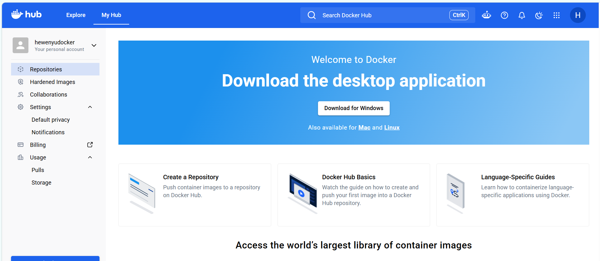
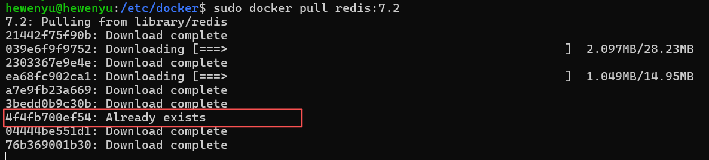
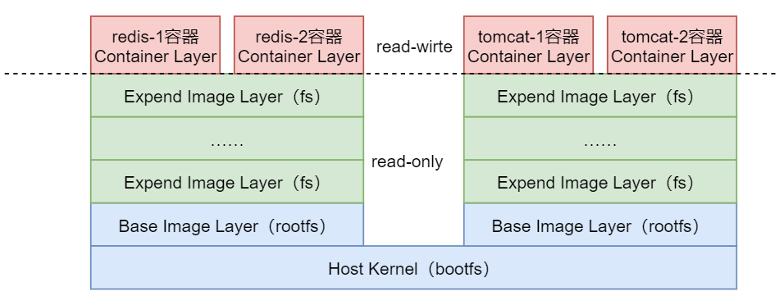

[toc]

# 1、`Docker` 镜像

## 1.1、镜像简介

镜像是一种轻量级、可执行的独立软件包，也可以说是一个精简的操作系统。镜像中包含应用软件及应用软件的运行环境。具体来说镜像包含运行某个软件所需的所有内容，包括代码、库、环境变量和配置文件等。

几乎所有应用，直接打包为Docker镜像后就可以运行。 由于镜像的运行时是容器，容器的设计初衷就是快速和小巧，所以镜像通常都比较小，镜像中不包含内核，其共享宿主机的内核；镜像中只包含简单的Shell，或没有Shell。

## 1.2、镜像仓库分类

镜像中心中存储着大量的镜像仓库 `Image Repository`，每个镜像仓库中包含着大量相关镜像。根据这些镜像发布者的不同，形成了四类不同的镜像仓库。

`docker hub` 地址: https://hub.docker.com/repositories/hewenyudocker



### 1.2.1、`Docker Official Image`

`Docker` 官方镜像仓库。该类仓库中的镜像由 `Docker` 官方构建发布，代码质量较高且安全，有较完善的文档。该类仓库中的镜像会及时更新。一般常用的系统、工具软件、中间件都有相应的官方镜像仓库。例如，Zookeeper、Redis、Nginx等。

官方镜像仓库的名称 `<repository>` 一般直接为该类软件的名称 `<software-name>`。

### 1.2.2、`Verified Publisher`

已验证发布者仓库。该类仓库中的镜像由非 `Docker` 官方的第三方发布。但该第三方是由 `Docker` 公司审核认证过的，一般为大型企业、团体或组织。审核通过后，`Docker`公司会向其颁发 `“VERIFIED PUBLISHER”` 标识。这种仓库中镜像的质量还有有保证的。

除了官方镜像仓库，其它都是非官方镜像仓库。非官方镜像仓库名称 `<repository>` 一般由发布者用户名与软件名称两部分构成，形式为：`<username>/<software-name>`。

### 1.2.3、`Sponsored OSS`

由 `Docker` 公司赞助开发的镜像仓库。该类仓库中的镜像也由非 `Docker` 官方的第三方发布，但该镜像的开发是由 `Docker` 公司赞助的。该类型的第三方一般为个人、团队或组织。

这种仓库中镜像的质量也是有保证的。

### 1.2.4、无认证仓库

没有以上任何标识的仓库。这种仓库中镜像的质量良莠不齐，质量上无法保证，在使用时需谨慎。

## 1.3、第三方镜像中心

镜像中心默认使用的都是 `Docker` 官方的 `Docker Hub`。不过，镜像中心是可配置的，可以使用指定的第三方镜像中心。对于第三方镜像中心中的仓库名称 `<repository>`由三部分构成：`<domain-name>/<username>/<software-name>`。其中的 `<domain-name>` 指的是第三方镜像中心的域名或IP。

## 1.4、镜像定位

对于任何镜像，都可通过 `<repository>:<tag>` 进行唯一定位。其中 `<tag>` 一般称为镜像的版本号。`<tag>` 中有一个比较特殊的版本—— `latest`。如果不指定，默认`<tag>`即为 `latest`。不过，虽然其字面意思是最新版，一般其也的确存放的是最新版，但并不能保证其真的就是最新版。


## 1.5、理解镜像


镜像 不是 “应用”，而是 “容器启动时的根文件系统”。​ 容器启动时，`Docker` 把 `image` 的所有层联合挂载成根目录，然后在这个根目录上运行你的进程（如 redis-server、java -jar）。

### 1.5.1、从“运行容器”的角度重新理解分层

> 1. image 的每一层 = 文件系统的一次“提交”

想象你从头搭建一个 Ubuntu 系统：

```txt
第 1 层：基础 Ubuntu 文件系统（/bin, /usr, /lib…）
第 2 层：安装 JDK（新增 /usr/lib/jvm/…）
第 3 层：复制你的 Java 应用 jar（新增 /app/myapp.jar）
第 4 层：修改配置文件（修改 /etc/myapp/config.yml）
```

`image` 就是这些层的静态堆叠。它不包含任何运行时的状态（进程、网络、环境变量等）。


> 2. 容器 = image + 可写层

当你 `docker run` 时，`Docker` 做两件事：

- 在所有只读层之上加一个空白可写层（容器层）
- 将所有层联合挂载到一个目录（比如 `/var/lib/docker/overlay2/<id>/merged`）

容器内的进程看到的文件系统就是这个合并后的目录。任何对文件系统的修改（新建、修改、删除）都发生在最顶层的可写层，下层的只读层永远不变。

```txt
┌─────────────────────────────┐
│ 可写层（容器层）             │  ← 运行时修改在这里
├─────────────────────────────┤
│ Layer 4: 配置文件            │  ← 只读
├─────────────────────────────┤
│ Layer 3: app.jar             │  ← 只读
├─────────────────────────────┤
│ Layer 2: JDK                 │  ← 只读
├─────────────────────────────┤
│ Layer 1: Ubuntu base         │  ← 只读
└─────────────────────────────┘
```

> 3. 为什么说“image 是容器的蓝图”？

- 同一个 `image` 可以启动多个容器，每个容器都有自己的可写层，互不干扰。
- 容器删除后，可写层消失，`image` 本身不受影响。
- 如果你想把容器的状态保存下来，可以 `docker commit`，把可写层压缩成一个新的只读层，追加到 `image` 上，形成新 `image`。


# 2、镜像相关命令

## 2.1、`docker pull`

`docker pull` 是 `Docker` 客户端用于从镜像仓库（默认 `Docker Hub`）下载镜像到本地的核心命令。

`docker pull` 根据镜像名称，从远程 `Registry` 找到指定的镜像，并将本地缺失的镜像数据（`Layers` 等）下载到 `Docker Engine` 的本地镜像存储中。它不是简单地下载一个 `.tar` 文件，而是根据镜像的 `Manifest` 找到组成 `Image` 所需要的多个 `Layer`，然后下载这些 `Layer`。

### 2.1.1、`docker pull` 基本语法

```shell
docker pull [OPTIONS] NAME[:TAG|@DIGEST]

# 完整写法
docker pull docker.io/library/redis:7.4

# 拆解下命令
docker pull [OPTIONS] NAME       :TAG
                         │        │
                         │        └── 7.4
                         │
                         └── docker.io/library/redis


# 简写， 默认的 register是 docker.io ，默认的 namespace 是 library
docker pull redis:7.4
```

- `NAME`：镜像名称。
- `TAG`：标签，默认为 `latest`。例如 `nginx:1.25`。
- `@DIGEST`：通过内容哈希值精确指定镜像版本，如 `nginx@sha256:xxx`。


> 一个完整的 `NAME` 由 `Registry`、`NameSpace`、`Respository` 组成：

- `Registry`: `Docker` 的镜像中心，类似于 `github`，默认为 `docker.io`;
- `NameSpace`: 镜像中心的组织名称，用于解决不同组织之间的 `Respository` 冲突问题，默认为 `library`;
- `Respository`: 镜像仓库，类似于 `maven` 仓库 `gav` 中的 `ga`，表示一个库，这个库可以有很多版本，版本就是 `tag`;

`docker` 镜像中的 `tag` 并不是指向一个完整的 `image` 镜像，`docker` 中的 `image` 镜像按照 `layer` 拆解成多个文件，不同版本可以复用相同的 `layer`，因此 `tag` 指向的是一个 `manifest` 清单文件，这个文件列出了对应 `tag` 版本所需要的 `layer` 文件列表;

例如: 下载指定版本的 redis 时，如果本地已经下载过其它版本，当前需要下载的目标版本的部分 `layer` 在本地已经存在时，无需重复下载



> OPTIONS 选项

| 选项                      | 说明                                               |
| ------------------------- | -------------------------------------------------- |
| `-a, --all-tags`          | 拉取仓库中所有标签的镜像                           |
| `--disable-content-trust` | 跳过镜像签名验证（默认启用）                       |
| `--platform`              | 指定目标操作系统/架构，如 linux/amd64, linux/arm64 |
| `-q, --quiet`             | 只显示摘要信息，不输出进度条                       |

> `docker pull` 命令流程拆解

```txt
docker pull [OPTIONS] NAME[:TAG|@DIGEST]
                         │
                         ▼
                       NAME
                         │
              ┌──────────┼──────────┐
              ▼          ▼          ▼
           Registry   Namespace  Repository
              │          │          │
           docker.io   library     redis
                                      │
                              ┌───────┴───────┐
                              ▼               ▼
                            :TAG          @DIGEST
                             7.4          sha256:...
                              │               │
                              └───────┬───────┘
                                      ▼
                                  Manifest
                                      │
                                    Layers
                                      │
                                      ▼
                                    Image
```

### 2.1.2、拉取 `redis`

```shell
hewenyu@hewenyu:/mnt/c/Users/he875$ sudo docker pull redis
[sudo] password for hewenyu:
Using default tag: latest
latest: Pulling from library/redis
910e63375a2f: Download complete
514dfa5816db: Pull complete
a326415e779c: Pull complete
26c307b5e35a: Pull complete
4f4fb700ef54: Pull complete
dbfb374a7f58: Pull complete
65405b53eed3: Pull complete
80c4a8d1ffc0: Pull complete
8e9e522279cf: Download complete
Digest: sha256:344e3945a0b431c8ff1eecd58c5573538126bd756f02fc7e218ddf1fc2546366
Status: Downloaded newer image for redis:latest
docker.io/library/redis:latest
```

## 2.2、`docker images` 或 `docker image ls`

通过 `docker images` 或 `docker image ls` 命令可查看本地所有镜像资源信息。这些镜像会按照镜像被创建的时间由近及远排序。

```shell
# docker images 查看本地镜像
hewenyu@hewenyu:/mnt/c/Users/he875$ sudo docker images
                                                                                                    i Info →   U  In Use
IMAGE                ID             DISK USAGE   CONTENT SIZE   EXTRA
hello-world:latest   7f4da0fc94bc       25.9kB         9.49kB    U
redis:latest         344e3945a0b4        212MB         57.4MB
# docker image ls 查看本地镜像
hewenyu@hewenyu:/mnt/c/Users/he875$ sudo docker image ls
                                                                                                    i Info →   U  In Use
IMAGE                ID             DISK USAGE   CONTENT SIZE   EXTRA
hello-world:latest   7f4da0fc94bc       25.9kB         9.49kB    U
redis:latest         344e3945a0b4        212MB         57.4MB
```

> 查看指定 `repository` 的镜像  `docker images redis`

```shell
hewenyu@hewenyu:/etc/docker$ sudo docker images redis
                                                                                                    i Info →   U  In Use
IMAGE          ID             DISK USAGE   CONTENT SIZE   EXTRA
redis:latest   344e3945a0b4        212MB         57.4MB
hewenyu@hewenyu:/etc/docker$ sudo docker image ls redis
                                                                                                    i Info →   U  In Use
IMAGE          ID             DISK USAGE   CONTENT SIZE   EXTRA
redis:latest   344e3945a0b4        212MB         57.4MB
```

> 查看镜像，并显示完整的镜像Id


默认的 `docker images` 显示的镜像id是经过截取后的显示结果，仅显示了前12位。使用 `--no-trunc` ( `truncate`截断 )参数后显示的是完成的镜像 `id`。

```shell
hewenyu@hewenyu:/etc/docker$ sudo docker images --no-trunc
[sudo] password for hewenyu:
REPOSITORY    TAG       IMAGE ID                                                                  CREATED        SIZE
redis         latest    sha256:344e3945a0b431c8ff1eecd58c5573538126bd756f02fc7e218ddf1fc2546366   7 days ago     212MB
hello-world   latest    sha256:7f4da0fc94bcece205a8c0b6f4d11c8196924654ffe5c4d1aa439b7f632048b2   4 months ago   25.9kB
```

> 查看镜像，并显示 `degest`

`--digests` 选项可以查看所有镜像或指定镜像的 `digest` 信息;

```shell
hewenyu@hewenyu:/etc/docker$ sudo docker images --digests
REPOSITORY    TAG       DIGEST                                                                    IMAGE ID       CREATED        SIZE
redis         latest    sha256:344e3945a0b431c8ff1eecd58c5573538126bd756f02fc7e218ddf1fc2546366   344e3945a0b4   7 days ago     212MB
hello-world   la
```

> 仅显示镜像Id

```shell
hewenyu@hewenyu:/etc/docker$ sudo docker images -q
344e3945a0b4
7f4da0fc94bc
hewenyu@hewenyu:/etc/docker$ sudo docker images redis -q
344e3945a0b4
hewenyu@hewenyu:/etc/docker$ sudo docker images redis -q --no-trunc
sha256:344e3945a0b431c8ff1eecd58c5573538126bd756f02fc7e218ddf1fc2546366
```


## 2.3、`docker rmi`

`rmi` (`remove images`), 该命令用于删除指定的本地镜像。镜像通过 `<repository>:<tag>` 指定。如果省略要删除镜像的`tag`，默认删除的是 `lastest` 版本。

```shell
hewenyu@hewenyu:/etc/docker$ sudo docker images
                                                                                                    i Info →   U  In Use
IMAGE                ID             DISK USAGE   CONTENT SIZE   EXTRA
hello-world:latest   7f4da0fc94bc       25.9kB         9.49kB    U
redis:7.0            352c1fdadc91        164MB         44.5MB
redis:7.2            6461ca4ac0c5        169MB         45.6MB
redis:latest         344e3945a0b4        212MB         57.4MB

# 删除redis镜像
hewenyu@hewenyu:/etc/docker$ sudo docker rmi redis:7.0
Untagged: redis:7.0
Deleted: sha256:352c1fdadc91926edda08f45aeb3f27f37194c2f14101229c0523a11195c96e3

hewenyu@hewenyu:/etc/docker$ sudo docker images
                                                                                                    i Info →   U  In Use
IMAGE                ID             DISK USAGE   CONTENT SIZE   EXTRA
hello-world:latest   7f4da0fc94bc       25.9kB         9.49kB    U
redis:7.2            6461ca4ac0c5        169MB         45.6MB
redis:latest         344e3945a0b4        212MB         57.4MB

# ====================

# docker rmi 可以一次删除多个镜像
hewenyu@hewenyu:/etc/docker$ sudo docker rmi redis:7.2 redis:latest
Untagged: redis:7.2
Deleted: sha256:6461ca4ac0c5c9d81d53685c3bf76aa81f464a9de6cf3a97b80a1da8d1bb1de4
Untagged: redis:latest
Deleted: sha256:344e3945a0b431c8ff1eecd58c5573538126bd756f02fc7e218ddf1fc2546366

hewenyu@hewenyu:/etc/docker$ sudo docker images
                                                                                                    i Info →   U  In Use
IMAGE                ID             DISK USAGE   CONTENT SIZE   EXTRA
hello-world:latest   7f4da0fc94bc       25.9kB         9.49kB    U

# ==================================


hewenyu@hewenyu:/etc/docker$ sudo docker images
                                                                                                    i Info →   U  In Use
IMAGE                ID             DISK USAGE   CONTENT SIZE   EXTRA
hello-world:latest   7f4da0fc94bc       25.9kB         9.49kB    U
redis:7.0            352c1fdadc91        164MB         44.5MB

# 根据 ImageId 删除镜像
hewenyu@hewenyu:/etc/docker$ sudo docker rmi 352c1fdadc91
Untagged: redis:7.0
Deleted: sha256:352c1fdadc91926edda08f45aeb3f27f37194c2f14101229c0523a11195c96e3

hewenyu@hewenyu:/etc/docker$ sudo docker images
                                                                                                    i Info →   U  In Use
IMAGE                ID             DISK USAGE   CONTENT SIZE   EXTRA
hello-world:latest   7f4da0fc94bc       25.9kB         9.49kB    U
```

### 2.3.1、强制删除镜像

默认情况下，对于已经运行了容器的镜像是不能删除的，必须要先停止并删除了相关容器然后才能删除其对应的镜像。不过，也可以通过添加 `-f` 选项进行强制删除。

```shell
# 已经运行的镜像删除失败
hewenyu@hewenyu:/etc/docker$ sudo docker rmi hello-world:latest
Error response from daemon: conflict: unable to delete hello-world:latest (must be forced) - container 304ab9fac4c3 is using its referenced image 7f4da0fc94bc

# 使用 -f 参数，强制删除
hewenyu@hewenyu:/etc/docker$ sudo docker rmi -f hello-world:latest
Untagged: hello-world:latest

# 本地镜像空了
hewenyu@hewenyu:/etc/docker$ sudo docker images
                                                                                                    i Info →   U  In Use
IMAGE   ID             DISK USAGE   CONTENT SIZE   EXTRA
hewenyu@hewenyu:/etc/docker$
```

### 2.3.2、使用组合命令删除所有镜像

使用组合命令删除所有镜像。当然，如果不携带 `-f` 选项，则不会删除已打开容器的镜像。 

```shell
hewenyu@hewenyu:/mnt/c/Users/he875$ sudo docker images
                                                                                                    i Info →   U  In Use
IMAGE                ID             DISK USAGE   CONTENT SIZE   EXTRA
hello-world:latest   7f4da0fc94bc       25.9kB         9.49kB    U

# 组合命令的方式，删除所有的镜像
hewenyu@hewenyu:/mnt/c/Users/he875$ sudo docker rmi -f $(sudo docker images -q)
Untagged: hello-world:latest
Deleted: sha256:7f4da0fc94bcece205a8c0b6f4d11c8196924654ffe5c4d1aa439b7f632048b2

hewenyu@hewenyu:/mnt/c/Users/he875$ sudo docker images
                                                                                                    i Info →   U  In Use
IMAGE   ID             DISK USAGE   CONTENT SIZE   EXTRA
hewenyu@hewenyu:/mnt/c/Users/he875$
```

## 2.4、镜像分层

`Docker` 镜像由一些松耦合的只读镜像层组成，`Docker Daemon`负责堆叠这些镜像层，并将它们关联为一个统一的整体，即对外表现出的是一个独立的对象。 通过`docker pull` 命令拉取指定的镜像时，每个`Pull complete`结尾的行就代表下载完毕了一个镜像层。

> redis 镜像拉取日志:

```shell
hewenyu@hewenyu:/mnt/c/Users/he875$ sudo docker pull redis
[sudo] password for hewenyu:
Using default tag: latest
latest: Pulling from library/redis
910e63375a2f: Download complete
514dfa5816db: Pull complete
a326415e779c: Pull complete
26c307b5e35a: Pull complete
4f4fb700ef54: Pull complete
dbfb374a7f58: Pull complete
65405b53eed3: Pull complete
80c4a8d1ffc0: Pull complete
8e9e522279cf: Download complete
Digest: sha256:344e3945a0b431c8ff1eecd58c5573538126bd756f02fc7e218ddf1fc2546366
Status: Downloaded newer image for redis:latest
docker.io/library/redis:latest
```


每个镜像层由两部分构成：镜像文件系统与镜像json文件。这两部分具有相同的 `ImageID`。 镜像文件系统就是对镜像占有的磁盘空间进行管理的文件系统，拥有该镜像所有镜像层的数据内容。而镜像json文件则是用于描述镜像的相关属性的集合，通过 `docker inspect` [镜像]就可以直观看到。

```shell
# 查看镜像信息
hewenyu@hewenyu:/mnt/c/Users/he875$ sudo docker inspect redis:7.2
[
    {
        "Id": "sha256:6461ca4ac0c5c9d81d53685c3bf76aa81f464a9de6cf3a97b80a1da8d1bb1de4",
        "RepoTags": [
            "redis:7.2"
        ],
        "RepoDigests": [
            "redis@sha256:6461ca4ac0c5c9d81d53685c3bf76aa81f464a9de6cf3a97b80a1da8d1bb1de4"
        ],
        "Comment": "buildkit.dockerfile.v0",
        "Created": "2026-08-05T00:38:36.6618041Z",
        "Config": {
            "ExposedPorts": {
                "6379/tcp": {}
            },
            "Env": [
                "PATH=/usr/local/sbin:/usr/local/bin:/usr/sbin:/usr/bin:/sbin:/bin",
                "REDIS_VERSION=7.2.15"
            ],
            "Entrypoint": [
                "docker-entrypoint.sh"
            ],
            "Cmd": [
                "redis-server"
            ],
            "Volumes": {
                "/data": {}
            },
            "WorkingDir": "/data"
        },
        "Architecture": "amd64",
        "Os": "linux",
        "Size": 43203431,
        "RootFS": {
            "Type": "layers",
            "Layers": [
                "sha256:66462cc862fe2053b9863fefa3866e07bb5dfb06f6b3ce3177cc096e4021aabe",
                "sha256:715096fa37288a0a05f6de361f2c05ba6c8fa141693d931f115f23563c4cc6a9",
                "sha256:974e2922b0a254d3c6e220ec15aba4d00f6b44d9d58b480fc93cd07f7800af46",
                "sha256:2b4806933d55d6a175b2e999bb9e636f0f4d9fab29025c1a49cb1c91e8ed0304",
                "sha256:55bf745129300f9f6a1b5d39d2a52a18ee007ef8cd73623d7a7ef88bb5e25596",
                "sha256:5f70bf18a086007016e948b04aed3b82103a36bea41755b6cddfaf10ace3c6ef",
                "sha256:2874b7399b95c57eb89ec97af104d728c0636c251b9ce68aaf4522f5cbf4f250"
            ]
        },
        "Metadata": {
            "LastTagTime": "2026-08-12T13:17:24.971385897Z"
        },
        "Descriptor": {
            "mediaType": "application/vnd.oci.image.index.v1+json",
            "digest": "sha256:6461ca4ac0c5c9d81d53685c3bf76aa81f464a9de6cf3a97b80a1da8d1bb1de4",
            "size": 10232
        }
    }
]
```


### 2.5、镜像 `FS` 构成

一个 `docker` 镜像的文件系统`FS`由多层只读的镜像层组成，每层都完成了特定的功能。而这些只读镜像层根据其位置与功能的不同可分为两类：基础镜像层与扩展镜像层。



`FS = File System`（文件系统）​ 的缩写。在 `Docker` 语境里，它特指镜像所采用的"分层/联合文件系统"（`Union File System`，也叫 `Union Mount`）。

`Docker` 镜像并不是一个大文件，而是由多个只读层（`read-only layer`）叠加而成，每一层都是一个文件系统快照。这种"叠加"能力正是由 `Union FS` 提供的。

```text
┌─────────────────────────────────────┐
│           可写层 (Container)         │  ← 容器运行时新增，可读可写
├─────────────────────────────────────┤
│  Layer N: 安装 redis                 │  ← 只读
├─────────────────────────────────────┤
│  Layer N-1: 安装依赖                 │  ← 只读
├─────────────────────────────────────┤
│  Layer 2: RUN apt-get update         │  ← 只读
├─────────────────────────────────────┤
│  Layer 1: FROM alpine:3.22           │  ← 只读（基础层）
├─────────────────────────────────────┤
│  Layer 0: 共享内核                    │  ← 宿主机 Linux 内核
└─────────────────────────────────────┘
```


## 2.6、导入导出镜像

在本地生成一个镜像，想将其导出后在另一电脑上使用，则可通过导出/导入镜像来完成。


## 2.6.1、导出镜像

`docker save` 命令用于将一个或多个镜像导出为 `tar文件`。例如，下面的命令是将 `ubuntu:latest` 与`tomcat:8.5.32` 镜像导出到当前 `/home/hewenyu/docker` 目录的`output_ubuntu_tomcat.tar`文件中。 

```shell
# 导出镜像
hewenyu@hewenyu:/mnt/c/Users/he875$ docker save -o "/home/hewenyu/docker/output_ubuntu_tomcat.tar" ubuntu:latest tomcat:8.5.32
# 查看导出的镜像
hewenyu@hewenyu:/mnt/c/Users/he875$ ls -la /home/hewenyu/docker
total 234408
drwxr-xr-x 2 hewenyu hewenyu      4096 Aug 16 22:56 .
drwxr-x--- 8 hewenyu hewenyu      4096 Aug 16 22:53 ..
-rw------- 1 hewenyu hewenyu 240024576 Aug 16 22:56 output_ubuntu_tomcat.tar
hewenyu@hewenyu:/mnt/c/Users/he875$
```

## 2.6.2、导入镜像

`docker load` 用于将一个 `tar 文件` 导入并加载为一个或多个镜像。

```shell
# 查看当前镜像
hewenyu@hewenyu:/mnt/c/Users/he875$ docker images
                                                                                            i Info →   U  In Use
IMAGE              ID             DISK USAGE   CONTENT SIZE   EXTRA
redis:7.2          6461ca4ac0c5        169MB         45.6MB
tomcat:8.5.32      bbdb0de8298a        710MB          195MB    U
ubuntu:latest      678c6550cc43        160MB         45.3MB    U
ubuntu:net-tools   54e8eb099508        229MB         71.6MB    U
# 删除 ubuntu:latest 和 tomcat:8.5.32 镜像
hewenyu@hewenyu:/mnt/c/Users/he875$ docker rmi -f ubuntu:latest tomcat:8.5.32
Untagged: ubuntu:latest
Untagged: tomcat:8.5.32
hewenyu@hewenyu:/mnt/c/Users/he875$ docker images
                                                                                            i Info →   U  In Use
IMAGE              ID             DISK USAGE   CONTENT SIZE   EXTRA
redis:7.2          6461ca4ac0c5        169MB         45.6MB
ubuntu:net-tools   54e8eb099508        229MB         71.6MB    U
# 从之前导出的 output_ubuntu_tomcat.tar 文件中导入镜像
hewenyu@hewenyu:/mnt/c/Users/he875$ docker load -i /home/hewenyu/docker/output_ubuntu_tomcat.tar
Loaded image: ubuntu:latest
Loaded image: tomcat:8.5.32
# 导入镜像成功
hewenyu@hewenyu:/mnt/c/Users/he875$ docker images
                                                                                            i Info →   U  In Use
IMAGE              ID             DISK USAGE   CONTENT SIZE   EXTRA
redis:7.2          6461ca4ac0c5        169MB         45.6MB
tomcat:8.5.32      bbdb0de8298a        710MB          195MB    U
ubuntu:latest      678c6550cc43        160MB         45.3MB    U
ubuntu:net-tools   54e8eb099508        229MB         71.6MB    U
hewenyu@hewenyu:/mnt/c/Users/he875$
```


