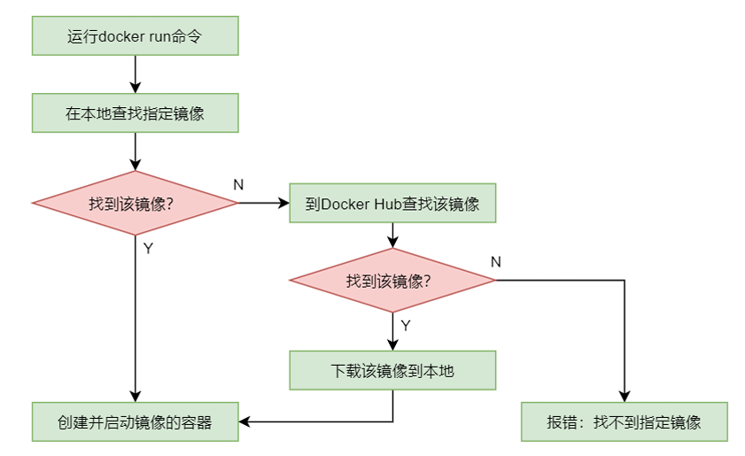
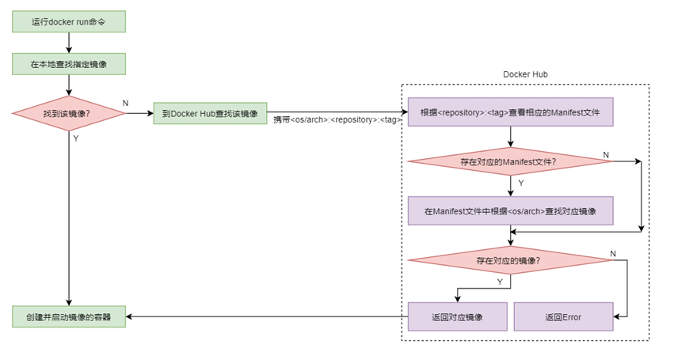
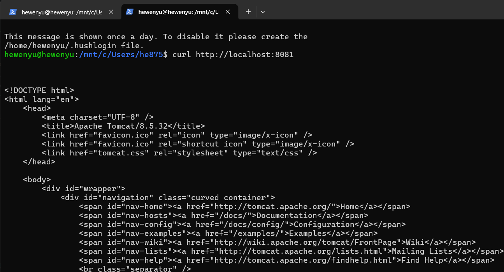
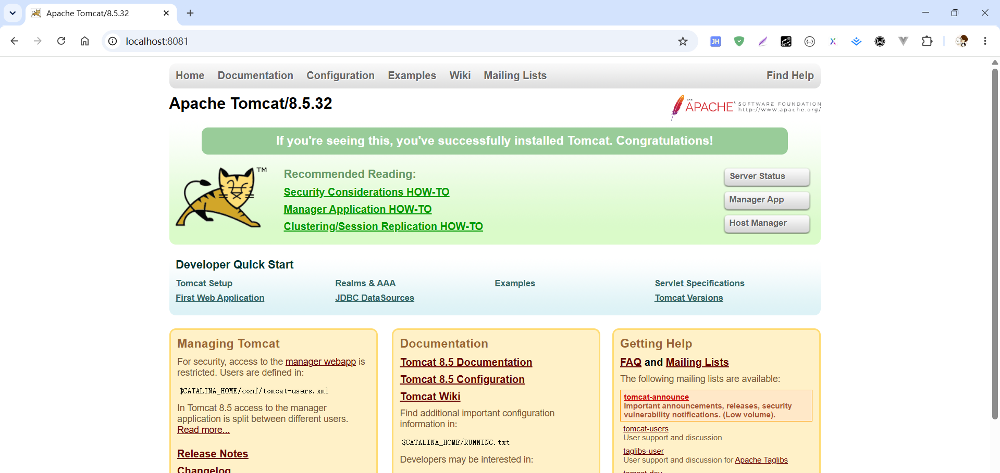

[toc]

# 1、`Docker` 容器

## 1.1、什么是 `Docker` 容器

- 容器时基于镜像创建的一个可运行的实例，可以启动、停止、删除。
- 每个容器相互隔离，拥有自己的文件系统、网络、进程空间。
- 容器与镜像的关系类似 面向对象中的“类”与“对象”：镜像是静态的只读模板，容器是动态的运行环境。

> 容器的完整生命周期

- `docker run` = `docker create` + `docker start`（一步到位创建并启动新容器）
- `docker start` 只能用于已经存在的容器（`Created` 或 `Stopped` 状态）

```xml
docker create
                         │
                         ▼
                    ┌─────────┐
                    │ Created │ （已创建，未运行）
                    └─────────┘
                         │
                    docker start
                         ▼
                    ┌─────────┐
                    │ Running │ （运行中）
                    └─────────┘
                         │
                    docker stop
                         ▼
                    ┌─────────┐
                    │ Stopped │ （已停止）
                    └─────────┘
                         │
                    docker rm
                         ▼
                      （被删除）
```

## 1.2、`Docker` 容器运行的本质

`Docker` 容器存在的意义就是为了运行容器中的应用，对外提供服务，所以启动容器的目的就是启动运行该容器中的应用。容器中的应用运行完毕后，容器就会自动终止。所以，如果不想让容器启动后立即终止运行，则就需要使容器应用不能立即结束。通常采用的方式有两种，使应用处于 **与用户交互的状态** 或 **等待状态** 。

## 1.3、`Docker` 容器的启动流程



通过 `docker run` 命令可以启动运行一个容器。该命令在执行时首先会在本地查找指定的镜像，如果找到了，则直接启动，否则会到镜像中心查找。如果镜像中心存在该镜像，则会下载到本地并启动，如果镜像中心也没有，则直接报错。

如果再与多架构镜像原理相整合，则就形成了完整的容器启动流程。



## 1.4、`docker` 容器命令

### 1.4.1、创建类(生成新容器)

| 命令                   | 作用                  |
| ---------------------- | --------------------- |
| `docker create 镜像名` | 仅创建容器（不启动）  |
| `docker run 镜像名`    | 创建 + 启动（最常用） |

> 注意: `docker run` 每次都会创建新容器，重复执行会创建多个；要复用同一个容器，用 `docker start`。

### 1.4.2、生命周期管理类（操作已存在的容器）

| 命令                    | 作用                 |
| ----------------------- | -------------------- |
| `docker start 容器名`   | 启动已停止的容器     |
| `docker stop 容器名`    | 优雅停止容器         |
| `docker restart 容器名` | 重启容器             |
| `docker pause 容器名`   | 暂停容器（冻结进程） |
| `docker unpause 容器名` | 恢复暂停的容器       |
| `docker rm 容器名`      | 删除已停止的容器     |
| `docker rm -f 容器名`   | 强制删除（含运行中） |

### 1.4.3、查看类

| 命令                    | 作用                     |
| ----------------------- | ------------------------ |
| `docker ps`             | 查看运行中的容器         |
| `docker ps -a`          | 查看所有容器（含已停止） |
| `docker logs 容器名`    | 查看日志                 |
| `docker inspect 容器名` | 查看详细信息             |
| `docker stats 容器名`   | 查看资源占用             |
| `docker top 容器名`     | 查看容器内进程           |

### 1.4.4、交互类

| 命令                           | 作用                       |
| ------------------------------ | -------------------------- |
| `docker exec -it 容器名 shell` | 在容器内执行新命令（推荐） |
| `docker attach 容器名`         | 连接到容器主进程           |


## 1.5、容器的创建与启动

对于容器的运行，有两种运行模式：交互模式与分离模式。下面通过运行 `ubuntu` 与 `tomcat` 来演示这两种运行模式的不同。


### 1.5.1、交互模式运行 `ubuntu`

```shell
hewenyu@hewenyu:/mnt/c/Users/he875$ docker run --name myubuntu -it ubuntu:latest /bin/bash
# 本地没有 ubuntu:latest 镜像
Unable to find image 'ubuntu:latest' locally
# 从远程拉取
latest: Pulling from library/ubuntu
a7fb98a8eddd: Pull complete
617772c7d19b: Pull complete
cc2ffdbc1bf7: Download complete
Digest: sha256:678c6550cc43645e08669028bc177f50be4e7c5b8cca677067b1914d4afc7a03
Status: Downloaded newer image for ubuntu:latest
# 镜像拉取到本地后，运行成为容器
root@ff86e9d07d1d:/#

# ff86e9d07d1d 表示的是 docker 容器的id
root@ff86e9d07d1d:/# pwd
/
# 容器中的系统是一个精简系统，很多命令是没有的
root@ff86e9d07d1d:/# ifconfig
bash: ifconfig: command not found
root@ff86e9d07d1d:/# touch a.txt
root@ff86e9d07d1d:/# ls
a.txt  bin  boot  dev  etc  home  lib  lib64  media  mnt  opt  proc  root  run  sbin  srv  sys  tmp  usr  var
root@ff86e9d07d1d:/# vim a.txt
bash: vim: command not found
root@ff86e9d07d1d:/# nano a.txt
bash: nano: command not found
root@ff86e9d07d1d:/# vi a.txt
bash: vi: command not found
root@ff86e9d07d1d:/#
```

`docker run --name myubuntu -it ubuntu:latest /bin/bash` 指令解析:

- `docker run`: 创建并运行一个新的容器
- `--name myubuntu`: 配置运行的容器名称
- `-it`: 指定以交互模式运行容器，且为容器分配一个伪终端。
- `ubuntu:latest`: 启动的容器镜像;
- `/bin/bash`: 用于指定容器启动后需要运行的命令为 `/bin` 下的 `bash` 命令，该命令会启动一个 `bash` 终端;


由于容器中的该系统是一个精简的系统，有很多常用命令是没有安装的，所以如果要使用这些命令，就需要安装;


### 1.5.2、交互模式运行 `tomcat`

#### 1.5.2.1、启动容器进入终端，不启动 `tomcat`

```shell
# 以交互模式启动 tomcat 并配置了 /bin/bash 终端
hewenyu@hewenyu:/mnt/c/Users/he875$ docker run --name tomcat8 -it tomcat:8.5.32 /bin/bash
Unable to find image 'tomcat:8.5.32' locally
8.5.32: Pulling from library/tomcat
2dcc81b69024: Pull complete
1290813abd9d: Pull complete
abb029e68402: Pull complete
9a8ea045c926: Pull complete
d068d0a738e5: Pull complete
42ee47bb0c52: Pull complete
ae9c861aed25: Pull complete
8a6b982ad6d7: Pull complete
1607093a898c: Pull complete
60bba9d0dc8d: Pull complete
55cbf04beb70: Pull complete
15222e409530: Pull complete
Digest: sha256:bbdb0de8298ab7281ff28331a9e4129562820ac54e243e44c3749f389876f562
Status: Downloaded newer image for tomcat:8.5.32
# 容器起来后，并没有启动 tomcat，而是进入了 /bin/bash 终端
root@2f1ff3ac9072:/usr/local/tomcat# ls
LICENSE  NOTICE  RELEASE-NOTES  RUNNING.txt  bin  conf  include  lib  logs  native-jni-lib  temp  webapps  work
root@2f1ff3ac9072:/usr/local/tomcat#
# 查看容器的进程信息
root@2f1ff3ac9072:/usr/local/tomcat# ls /proc/
1          config.gz  driver         iomem      kmsg           meminfo  pagetypeinfo  softirqs       timer_list
9          consoles   dynamic_debug  ioports    kpagecgroup    misc     partitions    stat           tty
acpi       cpuinfo    execdomains    irq        kpagecount     modules  pressure      swaps          uptime
buddyinfo  crypto     fb             kallsyms   kpageflags     mounts   schedstat     sys            version
bus        devices    filesystems    kcore      latency_stats  mpt      scsi          sysrq-trigger  vmallocinfo
cgroups    diskstats  fs             key-users  loadavg        mtrr     self          sysvipc        vmstat
cmdline    dma        interrupts     keys       locks          net      slabinfo      thread-self    zoneinfo
root@2f1ff3ac9072:/usr/local/tomcat#
```

关键点：`/bin/bash` 的作用

- `Tomcat` 官方镜像的默认 `CMD` 是 `catalina.sh run`（启动 `Tomcat` 服务器）。
- 在命令末尾显式写了 `/bin/bash`，这会覆盖默认的 `CMD`，容器启动后不再启动 `Tomcat`，而是直接运行 `Bash Shell`。
- 因为加了 `-it`，会立即进入容器的 `Bash` 终端（`root@2f1ff3ac9072:/usr/local/tomcat#`）。

#### 1.5.2.2、启动容器，并启动`tomcat`

```shell
# 以交互模式运行tomcat，不带 /bin/bash，此时会默认启动 tomcat
hewenyu@hewenyu:/mnt/c/Users/he875$ docker run --name tomcat8081 -it -p 8081:8080 tomcat:8.5.32
Using CATALINA_BASE:   /usr/local/tomcat
Using CATALINA_HOME:   /usr/local/tomcat
Using CATALINA_TMPDIR: /usr/local/tomcat/temp
Using JRE_HOME:        /docker-java-home/jre
Using CLASSPATH:       /usr/local/tomcat/bin/bootstrap.jar:/usr/local/tomcat/bin/tomcat-juli.jar
14-Aug-2026 07:18:23.241 INFO [main] org.apache.catalina.startup.VersionLoggerListener.log Server version:        Apache Tomcat/8.5.32
14-Aug-2026 07:18:23.245 INFO [main] org.apache.catalina.startup.VersionLoggerListener.log Server built:          Jun 20 2018 19:50:35 UTC
14-Aug-2026 07:18:23.245 INFO [main] org.apache.catalina.startup.VersionLoggerListener.log Server number:         8.5.32.0
14-Aug-2026 07:18:23.245 INFO [main] org.apache.catalina.startup.VersionLoggerListener.log OS Name:               Linux
14-Aug-2026 07:18:23.246 INFO [main] org.apache.catalina.startup.VersionLoggerListener.log OS Version:            6.6.87.2-microsoft-standard-WSL2
...
14-Aug-2026 07:18:24.222 INFO [main] org.apache.coyote.AbstractProtocol.start Starting ProtocolHandler ["http-nio-8080"]
14-Aug-2026 07:18:24.235 INFO [main] org.apache.coyote.AbstractProtocol.start Starting ProtocolHandler ["ajp-nio-8009"]
14-Aug-2026 07:18:24.242 INFO [main] org.apache.catalina.startup.Catalina.start Server startup in 778 ms

```

`docker run --name tomcat8080 -it -p 8080:8081 tomcat:8.5.32` 命令没有 `/bin/bash`，此时会真正启动 `tomcat`;

`-p 8080:8081` 为端口映射参数

- 左侧 `8081`：宿主机对外暴露的端口。
- 右侧 `8080`：容器内 `Tomcat` 默认监听的端口（在 `server.xml` 中配置）。

这是一个正确的映射：访问 `http://宿主机IP:8081` 即可访问容器内的 Tomcat 服务。


> 在 `tomcat` 容器的宿主机 `wsl` 上访问 `tomcat`



> 在 `wsl` 的宿主机 `win11` 上访问 `tomcat` 




### 1.5.3、分离模式运行 `tomcat`


```shell
# 分离模式启动一个 tomcat 容器
hewenyu@hewenyu:/mnt/c/Users/he875$ docker run --name mytomcat1 -dp 8081:8080 tomcat:8.5.32
93251bcb87f37d01434908d97d1e1351a8b8e853d8289867fb06d99235f03556
# 分离模式再启动一个 tomcat 容器
hewenyu@hewenyu:/mnt/c/Users/he875$ docker run --name mytomcat2 -dp 8082:8080 tomcat:8.5.32
5a9d06f00d94e371354fa12f7e3b98ba6c30b5dd631e2ff36f168ed45fddebeb
hewenyu@hewenyu:/mnt/c/Users/he875$ docker ps
# status Up 表示当前容器在运行
CONTAINER ID   IMAGE           COMMAND             CREATED          STATUS          PORTS                                         NAMES
5a9d06f00d94   tomcat:8.5.32   "catalina.sh run"   9 seconds ago    Up 8 seconds    0.0.0.0:8082->8080/tcp, [::]:8082->8080/tcp   mytomcat2
93251bcb87f3   tomcat:8.5.32   "catalina.sh run"   18 seconds ago   Up 17 seconds   0.0.0.0:8081->8080/tcp, [::]:8081->8080/tcp   mytomcat1
hewenyu@hewenyu:/mnt/c/Users/he875$
```

`-d` 选项表示以分离模式（`detached mode`）运行容器，即命令在后台运行，命令的运行与宿主机的运行分离开来。

```shell
# 不添加 -d 参数时，会占用当前终端
hewenyu@hewenyu:/mnt/c/Users/he875$ docker run --name mytomcat3 -p 8083:8080 tomcat:8.5.32
14-Aug-2026 08:19:17.003 INFO [main] org.apache.catalina.startup.VersionLoggerListener.log Server version:        Apache Tomcat/8.5.32
14-Aug-2026 08:19:17.007 INFO [main] org.apache.catalina.startup.VersionLoggerListener.log Server built:          Jun 20 2018 19:50:35 UTC
14-Aug-2026 08:19:17.007 INFO [main] org.apache.catalina.startup.VersionLoggerListener.log Server number:         8.5.32.0
14-Aug-2026 08:19:17.008 INFO [main] org.apache.catalina.startup.VersionLoggerListener.log OS Name:               Linux
14-Aug-2026 08:19:17.008 INFO [main] org.apache.catalina.startup.VersionLoggerListener.log OS Version:            6.6.87.2-microsoft-standard-WSL2
...
14-Aug-2026 08:19:17.930 INFO [main] org.apache.coyote.AbstractProtocol.start Starting ProtocolHandler ["http-nio-8080"]
14-Aug-2026 08:19:17.940 INFO [main] org.apache.coyote.AbstractProtocol.start Starting ProtocolHandler ["ajp-nio-8009"]
14-Aug-2026 08:19:17.948 INFO [main] org.apache.catalina.startup.Catalina.start Server startup in 753 ms

```

### 1.5.4、分离了模式运行 `ubuntu`


```shell
hewenyu@hewenyu:/mnt/c/Users/he875$ docker images
                                                                                                                 i Info →   U  In Use
IMAGE           ID             DISK USAGE   CONTENT SIZE   EXTRA
redis:7.2       6461ca4ac0c5        169MB         45.6MB
tomcat:8.5.32   bbdb0de8298a        710MB          195MB    U
ubuntu:latest   678c6550cc43        160MB         45.3MB    U
# 分离模式，在后台启动 ubuntu:latest 镜像的容器
hewenyu@hewenyu:/mnt/c/Users/he875$ docker run -d ubuntu:latest
839b43c3b8afad6838f832b1bba2fc73186b5174154465bcd87dc9c81958e254
# 查看正在运行的容器，没有找到新创建的 ubuntu 容器
hewenyu@hewenyu:/mnt/c/Users/he875$ docker ps
CONTAINER ID   IMAGE     COMMAND   CREATED   STATUS    PORTS     NAMES
# docker ps -a 可以看到 ubuntu 的容器起来后退出了
hewenyu@hewenyu:/mnt/c/Users/he875$ docker ps -a
CONTAINER ID   IMAGE           COMMAND             CREATED             STATUS                        PORTS     NAMES
839b43c3b8af   ubuntu:latest   "/bin/bash"         7 seconds ago       Exited (0) 6 seconds ago                cranky_brattain
fe991e4a5d35   ubuntu:latest   "/bin/bash"         55 seconds ago      Exited (0) 54 seconds ago               magical_maxwell
a336afe7e4b3   tomcat:8.5.32   "catalina.sh run"   59 minutes ago      Exited (130) 58 minutes ago             mytomcat3
5a9d06f00d94   tomcat:8.5.32   "catalina.sh run"   About an hour ago   Exited (143) 24 seconds ago             mytomcat2
93251bcb87f3   tomcat:8.5.32   "catalina.sh run"   About an hour ago   Exited (143) 24 seconds ago             mytomcat1
304ab9fac4c3   7f4da0fc94bc    "/hello"            2 days ago          Exited (0) 2 days ago                   exciting_banach
hewenyu@hewenyu:/mnt/c/Users/he875$
```

`docker run -d ubuntu:latest` 命令启动容器会立刻变成 `Exited`​ 状态，原因：

- `Ubuntu` 镜像默认命令是 `/bin/bash`。
- `bash` 在后台模式下没有 `-it` 分配终端，启动后检测到没有输入，立即退出。
- 容器主进程（`bash`）结束 → 容器停止。

结论：要让 `Ubuntu` 容器在后台持续运行，必须给它一个永不退出的前台进程。

解决方案：

> 方案1：`tail -f /dev/null`（最推荐）

`docker run -d --name myubuntu ubuntu tail -f /dev/null`

- `tail -f /dev/null` 一直阻塞读取空文件，永不退出。
- 容器保持 Up 状态。

```shell
hewenyu@hewenyu:/mnt/c/Users/he875$ docker run -d ubuntu tail -f /dev/null
ac69a952042c318f39b573cf3453fb685a067ef5af73ce1d1a411c8f512d54ae
hewenyu@hewenyu:/mnt/c/Users/he875$ docker ps
CONTAINER ID   IMAGE     COMMAND               CREATED         STATUS         PORTS     NAMES
ac69a952042c   ubuntu    "tail -f /dev/null"   9 seconds ago   Up 8 seconds             distracted_gauss
hewenyu@hewenyu:/mnt/c/Users/he875$
```

> 方案2: `sleep infinity`,无限休眠，保持容器运行。

```shell
hewenyu@hewenyu:/mnt/c/Users/he875$ docker run --name u1 -d ubuntu:latest sleep infinity
65e58075346ab8e5f8f2682b1896c445ee7df7c1af7917deba9c9a5d23367ec2
hewenyu@hewenyu:/mnt/c/Users/he875$ docker ps
CONTAINER ID   IMAGE           COMMAND            CREATED         STATUS         PORTS     NAMES
65e58075346a   ubuntu:latest   "sleep infinity"   5 seconds ago   Up 4 seconds             u1
hewenyu@hewenyu:/mnt/c/Users/he875$
```

> 方案3: bash -c "while true; do sleep 3600; done"

死循环，每隔一小时醒来一次，永不停歇

```shell
hewenyu@hewenyu:/mnt/c/Users/he875$ docker run -d --name myubuntu ubuntu bash -c "while true; do sleep 3600; done"
d6e80acab53caf74d7efa32adf75c042d00780e6146edefe0cee694d0fea0548
hewenyu@hewenyu:/mnt/c/Users/he875$ docker ps
CONTAINER ID   IMAGE           COMMAND                  CREATED          STATUS          PORTS     NAMES
d6e80acab53c   ubuntu          "bash -c 'while true…"   5 seconds ago    Up 5 seconds              myubuntu
65e58075346a   ubuntu:latest   "sleep infinity"         18 minutes ago   Up 18 minutes             u1
```

### 1.5.5、进入后台运行的容器

无论用哪种方法启动后台容器，进入方式相同:

```shell
hewenyu@hewenyu:/mnt/c/Users/he875$ docker ps
CONTAINER ID   IMAGE           COMMAND                  CREATED          STATUS          PORTS     NAMES
179d31a6e4b5   ubuntu:latest   "/bin/bash"              4 minutes ago    Up 4 minutes              ecstatic_bartik
d6e80acab53c   ubuntu          "bash -c 'while true…"   5 minutes ago    Up 5 minutes              myubuntu
65e58075346a   ubuntu:latest   "sleep infinity"         23 minutes ago   Up 23 minutes             u1
# 进入运行的容器，传容器id的方式
hewenyu@hewenyu:/mnt/c/Users/he875$ docker exec -it 179d31a6e4b5 bash
root@179d31a6e4b5:/# ls
bin  boot  dev  etc  home  lib  lib64  media  mnt  opt  proc  root  run  sbin  srv  sys  tmp  usr  var
root@179d31a6e4b5:/#

# 进入运行的容器，传容器名称的方式
hewenyu@hewenyu:/mnt/c/Users/he875$ docker exec -it myubuntu bash
root@d6e80acab53c:/# ls
bin  boot  dev  etc  home  lib  lib64  media  mnt  opt  proc  root  run  sbin  srv  sys  tmp  usr  var
root@d6e80acab53c:/#
```

进入运行的容器内部后，如果想停止容器运行可以使用 `docker stop 容器名称` 的方式。如果想退出容器但是保持容器运行，可以使用 `ctrl+p+q` (先按住 `ctrl+p` 然后按 `q`)的快捷键组合退出容器；

### 1.5.6、容器退出命令

#### 1.5.6.1、交互模式启动容器执行 `exit`

交互模式运行的 `ubuntu` 容器，在命令行中运行 `exit` 命令后，通过 `docker ps –a` 可以查看到该容器已经退出了。

```shell
# 交互模式启动 ubuntu 镜像的容器
hewenyu@hewenyu:/mnt/c/Users/he875$ docker run --name u1 -it ubuntu:latest /bin/bash
root@9a298f85467d:/# ls
bin  boot  dev  etc  home  lib  lib64  media  mnt  opt  proc  root  run  sbin  srv  sys  tmp  usr  var
# 执行 exit 命令
root@9a298f85467d:/# exit
exit
# 退出容器后，执行 docker ps 发现 u1 容器已经关闭了
hewenyu@hewenyu:/mnt/c/Users/he875$ docker ps
CONTAINER ID   IMAGE     COMMAND   CREATED   STATUS    PORTS     NAMES
hewenyu@hewenyu:/mnt/c/Users/he875$ docker ps -a
CONTAINER ID   IMAGE           COMMAND       CREATED          STATUS                     PORTS     NAMES
9a298f85467d   ubuntu:latest   "/bin/bash"   12 seconds ago   Exited (0) 7 seconds ago             u1
304ab9fac4c3   7f4da0fc94bc    "/hello"      4 days ago       Exited (0) 4 days ago                exciting_banach
hewenyu@hewenyu:/mnt/c/Users/he875$
```

交互模式运行的 `tomcat` 容器，在 `bash` 终端中执行 `exit` 命令后，会关闭容器并退出

```shell
# 交互模式启动 taomcat ，由于带了 /bin/bash 参数，此时会启动容器，但是不会启动 tomcat
hewenyu@hewenyu:/mnt/c/Users/he875$ docker run --name t1 -it tomcat:8.5.32 /bin/bash
root@37cc5800fa4c:/usr/local/tomcat# ls
LICENSE  NOTICE  RELEASE-NOTES  RUNNING.txt  bin  conf  include  lib  logs  native-jni-lib  temp  webapps  work
# 在容器内部执行 exit 命令
root@37cc5800fa4c:/usr/local/tomcat# exit
exit
# 查看正在运行的容器，发现没有 t1 容器
hewenyu@hewenyu:/mnt/c/Users/he875$ docker ps
CONTAINER ID   IMAGE     COMMAND   CREATED   STATUS    PORTS     NAMES
# 查看所有的容器，发现 t1 容器已经关闭了
hewenyu@hewenyu:/mnt/c/Users/he875$ docker ps -a
CONTAINER ID   IMAGE           COMMAND       CREATED          STATUS                     PORTS     NAMES
37cc5800fa4c   tomcat:8.5.32   "/bin/bash"   10 seconds ago   Exited (0) 5 seconds ago             t1
9a298f85467d   ubuntu:latest   "/bin/bash"   3 minutes ago    Exited (0) 3 minutes ago             u1
304ab9fac4c3   7f4da0fc94bc    "/hello"      4 days ago       Exited (0) 4 days ago                exciting_banach
hewenyu@hewenyu:/mnt/c/Users/he875$
```

#### 1.5.6.2、分离模式启动容器，进入容器后再执行 `exit`

分离模式运行的 `ubuntu` 容器，执行 `docker exec -it u2 bash` 命令，进入 `ubuntu` 容器后，在内部执行 `exit` 命令，此时会关闭 `bash` 终端，但是不会退出容器

```shell
# 查看当前运行的容器
hewenyu@hewenyu:/mnt/c/Users/he875$ docker ps
CONTAINER ID   IMAGE     COMMAND   CREATED   STATUS    PORTS     NAMES
# 分离模式启动 ubuntu 容器
hewenyu@hewenyu:/mnt/c/Users/he875$ docker run --name u2 -d ubuntu:latest tail -f /dev/null
81b034ab278c61422374f7875103396926e08c96cbbf5c23ed554cc98064199f
# 启动后，可以看到当前 u2 容器正在运行
hewenyu@hewenyu:/mnt/c/Users/he875$ docker ps
CONTAINER ID   IMAGE           COMMAND               CREATED         STATUS         PORTS     NAMES
81b034ab278c   ubuntu:latest   "tail -f /dev/null"   3 seconds ago   Up 2 seconds             u2
# 进入分离模式运行的容器内部
hewenyu@hewenyu:/mnt/c/Users/he875$ docker exec -it u2 bash
root@81b034ab278c:/# ls
bin  boot  dev  etc  home  lib  lib64  media  mnt  opt  proc  root  run  sbin  srv  sys  tmp  usr  var
# 执行 exit 命令，退出
root@81b034ab278c:/# exit
exit
# 执行 docker ps 命令，此时可以看到 u2 容器还在运行
hewenyu@hewenyu:/mnt/c/Users/he875$ docker ps
CONTAINER ID   IMAGE           COMMAND               CREATED          STATUS          PORTS     NAMES
81b034ab278c   ubuntu:latest   "tail -f /dev/null"   30 seconds ago   Up 29 seconds             u2
hewenyu@hewenyu:/mnt/c/Users/he875$
```

此时需要执行 `docker stop` 命令关闭容器

```shell
hewenyu@hewenyu:/mnt/c/Users/he875$ docker stop u2
u2
hewenyu@hewenyu:/mnt/c/Users/he875$ docker ps
CONTAINER ID   IMAGE     COMMAND   CREATED   STATUS    PORTS     NAMES
hewenyu@hewenyu:/mnt/c/Users/he875$ docker ps -a
CONTAINER ID   IMAGE           COMMAND               CREATED          STATUS                            PORTS     NAMES
81b034ab278c   ubuntu:latest   "tail -f /dev/null"   5 minutes ago    Exited (137) About a minute ago             u2
37cc5800fa4c   tomcat:8.5.32   "/bin/bash"           11 minutes ago   Exited (0) 11 minutes ago                   t1
9a298f85467d   ubuntu:latest   "/bin/bash"           14 minutes ago   Exited (0) 14 minutes ago                   u1
304ab9fac4c3   7f4da0fc94bc    "/hello"              4 days ago       Exited (0) 4 days ago                       exciting_banach
hewenyu@hewenyu:/mnt/c/Users/he875$
```

#### 1.5.6.3、退出交互模式启动的的容器而不关闭容器 `ctrl+p+q`


注：先按下Ctrl + P，然后再按下Q。

```shell
# 交互模式启动 ubuntu 容器
hewenyu@hewenyu:/mnt/c/Users/he875$ docker run --name u3 -it ubuntu:latest /bin/bash
root@4dc2f201c510:/# ls
bin  boot  dev  etc  home  lib  lib64  media  mnt  opt  proc  root  run  sbin  srv  sys  tmp  usr  var
# 执行 ctrl + p 然后再 按下 q 组合键后退出了 u3 的交互终端
# 此时执行 docker ps 命令，发现容器还在运行
hewenyu@hewenyu:/mnt/c/Users/he875$ docker ps
CONTAINER ID   IMAGE           COMMAND       CREATED          STATUS          PORTS     NAMES
4dc2f201c510   ubuntu:latest   "/bin/bash"   15 seconds ago   Up 14 seconds             u3
hewenyu@hewenyu:/mnt/c/Users/he875$
```

#### 1.5.6.4、`attach` 命令退出容器并结束容器

`docker attach` 命令进入分离模式运行的容器时，不会新建进程，而是直接在容器进程内部运行，此时执行 `exit` 命令会关闭当前进程，导致容器也关闭了;

```shell
hewenyu@hewenyu:/mnt/c/Users/he875$ docker ps
CONTAINER ID   IMAGE           COMMAND             CREATED          STATUS          PORTS                                         NAMES
0598fe426396   tomcat:8.5.32   "catalina.sh run"   32 minutes ago   Up 32 minutes   0.0.0.0:8081->8080/tcp, [::]:8081->8080/tcp   t2
4dc2f201c510   ubuntu:latest   "/bin/bash"         48 minutes ago   Up 48 minutes                                                 u3
# 使用 attach 命令，进入后台运行的容器
hewenyu@hewenyu:/mnt/c/Users/he875$ docker attach u3
root@4dc2f201c510:/# ls
bin  boot  dev  etc  home  lib  lib64  media  mnt  opt  proc  root  run  sbin  srv  sys  tmp  usr  var
# 执行 exit 命令退出容器
root@4dc2f201c510:/# exit
exit
# 此时可以看到 u3 容器也退出了
hewenyu@hewenyu:/mnt/c/Users/he875$ docker ps
CONTAINER ID   IMAGE           COMMAND             CREATED          STATUS          PORTS                                         NAMES
0598fe426396   tomcat:8.5.32   "catalina.sh run"   32 minutes ago   Up 32 minutes   0.0.0.0:8081->8080/tcp, [::]:8081->8080/tcp   t2
hewenyu@hewenyu:/mnt/c/Users/he875$
```

## 1.6、容器状态查看命令

> `docker ps` 查看所有正在运行的容器

```shell
hewenyu@hewenyu:/mnt/c/Users/he875$ docker ps
CONTAINER ID   IMAGE           COMMAND       CREATED         STATUS         PORTS     NAMES
4dc2f201c510   ubuntu:latest   "/bin/bash"   3 minutes ago   Up 3 minutes             u3
hewenyu@hewenyu:/mnt/c/Users/he875$
```

> `docker ps -a` 查看所有容器

```shell
# 可以看到，除了 u3 容器状态时 up，其它几个容器都是退出状态
hewenyu@hewenyu:/mnt/c/Users/he875$ docker ps -a
CONTAINER ID   IMAGE           COMMAND               CREATED          STATUS                       PORTS     NAMES
4dc2f201c510   ubuntu:latest   "/bin/bash"           4 minutes ago    Up 4 minutes                           u3
81b034ab278c   ubuntu:latest   "tail -f /dev/null"   12 minutes ago   Exited (137) 8 minutes ago             u2
37cc5800fa4c   tomcat:8.5.32   "/bin/bash"           17 minutes ago   Exited (0) 17 minutes ago              t1
9a298f85467d   ubuntu:latest   "/bin/bash"           20 minutes ago   Exited (0) 20 minutes ago              u1
304ab9fac4c3   7f4da0fc94bc    "/hello"              4 days ago       Exited (0) 4 days ago                  exciting_banach
hewenyu@hewenyu:/mnt/c/Users/he875$
```

> `docker ps -aq` 查看所有容器的id

```shell
# -q 参数表示只查看容器的id
hewenyu@hewenyu:/mnt/c/Users/he875$ docker ps -aq
4dc2f201c510
81b034ab278c
37cc5800fa4c
9a298f85467d
304ab9fac4c3
hewenyu@hewenyu:/mnt/c/Users/he875$
```

> `docker ps -l` 查看最后创建的容器，无论该容器是否正在运行

```shell
# u3 容器正在运行
hewenyu@hewenyu:/mnt/c/Users/he875$ docker ps -l
CONTAINER ID   IMAGE           COMMAND       CREATED         STATUS         PORTS     NAMES
4dc2f201c510   ubuntu:latest   "/bin/bash"   6 minutes ago   Up 6 minutes             u3

# 分离模式启动 u4 容器，不阻塞运行容器，此时 u4 会立即关闭
hewenyu@hewenyu:/mnt/c/Users/he875$ docker run --name u4 -d ubuntu:latest
f35bd17da35b4ad56046f95706fbfa352b3520f760c29f0bd59cf6ab2bacc926
# 此时 u4 容器是 exited 状态
hewenyu@hewenyu:/mnt/c/Users/he875$ docker ps -a
CONTAINER ID   IMAGE           COMMAND               CREATED          STATUS                        PORTS     NAMES
f35bd17da35b   ubuntu:latest   "/bin/bash"           8 seconds ago    Exited (0) 7 seconds ago                u4
4dc2f201c510   ubuntu:latest   "/bin/bash"           8 minutes ago    Up 8 minutes                            u3
81b034ab278c   ubuntu:latest   "tail -f /dev/null"   16 minutes ago   Exited (137) 12 minutes ago             u2
37cc5800fa4c   tomcat:8.5.32   "/bin/bash"           21 minutes ago   Exited (0) 21 minutes ago               t1
9a298f85467d   ubuntu:latest   "/bin/bash"           24 minutes ago   Exited (0) 24 minutes ago               u1
304ab9fac4c3   7f4da0fc94bc    "/hello"              4 days ago       Exited (0) 4 days ago                   exciting_banach
# 查看最后一次运行的容器，此时可以看到是 u4 容器
hewenyu@hewenyu:/mnt/c/Users/he875$ docker ps -l
CONTAINER ID   IMAGE           COMMAND       CREATED          STATUS                      PORTS     NAMES
f35bd17da35b   ubuntu:latest   "/bin/bash"   15 seconds ago   Exited (0) 14 seconds ago             u4
hewenyu@hewenyu:/mnt/c/Users/he875$
```


> `docker ps -n 3` 查看最后创建的3个容器

```shell
# 查看最后创建的3个容器
hewenyu@hewenyu:/mnt/c/Users/he875$ docker ps -n 3
CONTAINER ID   IMAGE           COMMAND               CREATED          STATUS                        PORTS     NAMES
f35bd17da35b   ubuntu:latest   "/bin/bash"           2 minutes ago    Exited (0) 2 minutes ago                u4
4dc2f201c510   ubuntu:latest   "/bin/bash"           10 minutes ago   Up 10 minutes                           u3
81b034ab278c   ubuntu:latest   "tail -f /dev/null"   18 minutes ago   Exited (137) 14 minutes ago             u2
# 添加 -q 参数，之查看最后三个容器的id，可以看到，-q的位置要在 n 前面
hewenyu@hewenyu:/mnt/c/Users/he875$ docker ps -nq 3
invalid argument "q" for "-n, --last" flag: strconv.ParseInt: parsing "q": invalid syntax

Usage:  docker ps [OPTIONS]

Run 'docker ps --help' for more information
hewenyu@hewenyu:/mnt/c/Users/he875$ docker ps -qn 3
f35bd17da35b
4dc2f201c510
81b034ab278c
```

## 1.7、容器再进入命令 `docker exec`

当我们以分离模式运行了一个容器，或以交互模式运行了一个容器，但容器内部执行的命令占用了交互命令行，而此时我们又想进入到容器中对容器内部进行一些操作，此时就需要用到 `exec/attach` 命令了。 

注意，它们只能对正在运行的容器进行操作。

```shell
# 分离模式启动 tomcat 容器 t2
hewenyu@hewenyu:/mnt/c/Users/he875$ docker run --name t2 -dp 8081:8080 tomcat:8.5.32
0598fe42639616894df9c43f5ad7352bda6ed466b8cbb4fdfa454ee8723910fd
# 当前 t2 容器正在运行
hewenyu@hewenyu:/mnt/c/Users/he875$ docker ps
CONTAINER ID   IMAGE           COMMAND             CREATED          STATUS          PORTS                                         NAMES
0598fe426396   tomcat:8.5.32   "catalina.sh run"   3 seconds ago    Up 2 seconds    0.0.0.0:8081->8080/tcp, [::]:8081->8080/tcp   t2
4dc2f201c510   ubuntu:latest   "/bin/bash"         15 minutes ago   Up 15 minutes                                                 u3

# 执行 docker exec 命令，进入 t2 容器内部
hewenyu@hewenyu:/mnt/c/Users/he875$ docker exec -it t2 bash
root@0598fe426396:/usr/local/tomcat# ls
LICENSE  NOTICE  RELEASE-NOTES  RUNNING.txt  bin  conf  include  lib  logs  native-jni-lib  temp  webapps  work
# 执行 exit 命令，退出 bash 终端
root@0598fe426396:/usr/local/tomcat# exit
exit
# 此时 t2 容器还在运行
hewenyu@hewenyu:/mnt/c/Users/he875$ docker ps
CONTAINER ID   IMAGE           COMMAND             CREATED              STATUS              PORTS                                         NAMES
0598fe426396   tomcat:8.5.32   "catalina.sh run"   About a minute ago   Up About a minute   0.0.0.0:8081->8080/tcp, [::]:8081->8080/tcp   t2
4dc2f201c510   ubuntu:latest   "/bin/bash"         16 minutes ago       Up 16 minutes                                                     u3
hewenyu@hewenyu:/mnt/c/Users/he875$
```

注意: `exec`命令会创建一个新的独立于容器的进程，而 `exit` 命令仅用于结束该新建进程。


## 1.8、外部操作容器 `docker exec`

`docker exec` 命令也可以在不进入容器的情况下执行容器内部的命令。例如仅想查看tomcat容器中工作目录中所包含的文件，直接在exec命令后紧
跟要执行的命令即可直接看到其结果。

```shell
hewenyu@hewenyu:/mnt/c/Users/he875$ docker exec -it t2 ls -la
total 136
drwxr-sr-x 1 root staff  4096 Aug 14  2018 .
drwxrwsr-x 1 root staff  4096 Aug 14  2018 ..
-rw-r----- 1 root root  57092 Jun 20  2018 LICENSE
-rw-r----- 1 root root   1723 Jun 20  2018 NOTICE
-rw-r----- 1 root root   7138 Jun 20  2018 RELEASE-NOTES
-rw-r----- 1 root root  16246 Jun 20  2018 RUNNING.txt
drwxr-x--- 2 root root   4096 Aug 14  2018 bin
drwx--S--- 1 root root   4096 Aug 16 07:20 conf
drwxr-sr-x 3 root staff  4096 Aug 14  2018 include
drwxr-x--- 2 root root   4096 Aug 14  2018 lib
drwxr-x--- 1 root root   4096 Aug 16 07:20 logs
drwxr-sr-x 3 root staff  4096 Aug 14  2018 native-jni-lib
drwxr-x--- 2 root root   4096 Aug 14  2018 temp
drwxr-x--- 7 root root   4096 Jun 20  2018 webapps
drwxr-x--- 1 root root   4096 Aug 16 07:20 work
```

## 1.9、查看容器内进程信息

```shell
hewenyu@hewenyu:/mnt/c/Users/he875$ docker top t2
UID                 PID                 PPID                C                   STIME               TTY                 TIME                CMD
root                2801                2773                0                   15:17               ?                   00:00:11            /docker-java-home/jre/bin/java -Djava.util.logging.config.file=/usr/local/tomcat/conf/logging.properties -Djava.util.logging.manager=org.apache.juli.ClassLoaderLogManager -Djdk.tls.ephemeralDHKeySize=2048 -Djava.protocol.handler.pkgs=org.apache.catalina.webresources -Dorg.apache.catalina.security.SecurityListener.UMASK=0027 -Dignore.endorsed.dirs= -classpath /usr/local/tomcat/bin/bootstrap.jar:/usr/local/tomcat/bin/tomcat-juli.jar -Dcatalina.base=/usr/local/tomcat -Dcatalina.home=/usr/local/tomcat -Djava.io.tmpdir=/usr/local/tomcat/temp org.apache.catalina.startup.Bootstrap start
```

## 1.10、容器内日志查看命令

`docker logs [容器]` 可以查看指定容器中应用的运行日志，无论该容器是运行还是停止状态。 

### 1.10.1、查看所有日志

`docker logs` 查看的是所有容器中应用的运行日志。这个日志对于不同的容器来说，其日志内容是不同的。由 `docker run` 命令的[command]决定（如果没有则由`Dockerfile`中的`CMD`指令决定）。

> 查看 `tomcat` 日志

```shell
# 查看 t2 容器的日志，由于 t2 启动了 tomcat 容器，此时日志内容为 tomcat 的启停日志
hewenyu@hewenyu:/mnt/c/Users/he875$ docker logs t2
16-Aug-2026 07:20:09.815 INFO [main] org.apache.catalina.startup.VersionLoggerListener.log Server version:        Apache Tomcat/8.5.32
16-Aug-2026 07:20:09.820 INFO [main] org.apache.catalina.startup.VersionLoggerListener.log Server built:          Jun 20 2018 19:50:35 UTC
16-Aug-2026 07:20:09.820 INFO [main] org.apache.catalina.startup.VersionLoggerListener.log Server number:         8.5.32.0
16-Aug-2026 07:20:09.820 INFO [main] org.apache.catalina.startup.VersionLoggerListener.log OS Name:               Linux
16-Aug-2026 07:20:09.821 INFO [main] org.apache.catalina.startup.VersionLoggerListener.log OS Version:            6.6.87.2-microsoft-standard-WSL2
...
```

> 查看 `ubuntu` 日志

```shell
# 对于 ubuntu 来说，docker logs 输出的就是 /bin/bash 运行的历史记录
hewenyu@hewenyu:/mnt/c/Users/he875$ docker logs u3
root@4dc2f201c510:/# ls
bin  boot  dev  etc  home  lib  lib64  media  mnt  opt  proc  root  run  sbin  srv  sys  tmp  usr  var
root@4dc2f201c510:/# ls
bin  boot  dev  etc  home  lib  lib64  media  mnt  opt  proc  root  run  sbin  srv  sys  tmp  usr  var
root@4dc2f201c510:/# exit
exit
```

### 1.10.2、查看最后几条日志

通过添加选项 `-n` 或 `--tail` 可以指定要显示的最后几条日志。

```shell
hewenyu@hewenyu:/mnt/c/Users/he875$ docker logs -n 3 u3
bin  boot  dev  etc  home  lib  lib64  media  mnt  opt  proc  root  run  sbin  srv  sys  tmp  usr  var
root@4dc2f201c510:/# exit
exit
hewenyu@hewenyu:/mnt/c/Users/he875$ docker logs --tail 3 u3
bin  boot  dev  etc  home  lib  lib64  media  mnt  opt  proc  root  run  sbin  srv  sys  tmp  usr  var
root@4dc2f201c510:/# exit
exit
hewenyu@hewenyu:/mnt/c/Users/he875$
```

### 1.11、启动已经关闭的容器

通过 `docker start` 命令可以启动已经停止的指定容器，这个容器可以通过容器名称指定，也可以通过容器ID指定。

```shell
hewenyu@hewenyu:/mnt/c/Users/he875$ docker start u3
u3
hewenyu@hewenyu:/mnt/c/Users/he875$
hewenyu@hewenyu:/mnt/c/Users/he875$
hewenyu@hewenyu:/mnt/c/Users/he875$ docker ps
CONTAINER ID   IMAGE           COMMAND             CREATED          STATUS          PORTS                                         NAMES
0598fe426396   tomcat:8.5.32   "catalina.sh run"   40 minutes ago   Up 40 minutes   0.0.0.0:8081->8080/tcp, [::]:8081->8080/tcp   t2
4dc2f201c510   ubuntu:latest   "/bin/bash"         56 minutes ago   Up 4 seconds                                                  u3
hewenyu@hewenyu:/mnt/c/Users/he875$ 
```

### 1.11.1、重启容器

通过 `docker restart` 命令可以重启处于运行状态的指定容器。如果时关闭的容器，则会启动改容器;

```shell
hewenyu@hewenyu:/mnt/c/Users/he875$ docker ps
CONTAINER ID   IMAGE           COMMAND             CREATED             STATUS          PORTS                                         NAMES
0598fe426396   tomcat:8.5.32   "catalina.sh run"   45 minutes ago      Up 45 minutes   0.0.0.0:8081->8080/tcp, [::]:8081->8080/tcp   t2
4dc2f201c510   ubuntu:latest   "/bin/bash"         About an hour ago   Up 4 minutes                                                  u3
hewenyu@hewenyu:/mnt/c/Users/he875$
# docker restart 可以重启正在运行的容器
hewenyu@hewenyu:/mnt/c/Users/he875$ docker restart u3
u3
# docker restart 也可以启动当前关闭的容器
hewenyu@hewenyu:/mnt/c/Users/he875$ docker restart u2
u2
hewenyu@hewenyu:/mnt/c/Users/he875$ docker ps
CONTAINER ID   IMAGE           COMMAND               CREATED             STATUS          PORTS                                         NAMES
0598fe426396   tomcat:8.5.32   "catalina.sh run"     46 minutes ago      Up 46 minutes   0.0.0.0:8081->8080/tcp, [::]:8081->8080/tcp   t2
4dc2f201c510   ubuntu:latest   "/bin/bash"           About an hour ago   Up 11 seconds                                                 u3
81b034ab278c   ubuntu:latest   "tail -f /dev/null"   About an hour ago   Up 3 seconds                                                  u2
hewenyu@hewenyu:/mnt/c/Users/he875$
```

## 1.12、关闭容器

### 1.12.1、`docker stop` 停止容器

通过 `docker stop` 命令可以停止指定容器。若当前容器正在被其它进程访问，则在访问结束后再停止。

```shell
hewenyu@hewenyu:/mnt/c/Users/he875$ docker ps
CONTAINER ID   IMAGE           COMMAND               CREATED             STATUS          PORTS                                         NAMES
0598fe426396   tomcat:8.5.32   "catalina.sh run"     48 minutes ago      Up 48 minutes   0.0.0.0:8081->8080/tcp, [::]:8081->8080/tcp   t2
4dc2f201c510   ubuntu:latest   "/bin/bash"           About an hour ago   Up 2 minutes                                                  u3
81b034ab278c   ubuntu:latest   "tail -f /dev/null"   About an hour ago   Up 2 minutes                                                  u2
hewenyu@hewenyu:/mnt/c/Users/he875$ docker stop u2
u2
hewenyu@hewenyu:/mnt/c/Users/he875$ docker ps
CONTAINER ID   IMAGE           COMMAND             CREATED             STATUS          PORTS                                         NAMES
0598fe426396   tomcat:8.5.32   "catalina.sh run"   48 minutes ago      Up 48 minutes   0.0.0.0:8081->8080/tcp, [::]:8081->8080/tcp   t2
4dc2f201c510   ubuntu:latest   "/bin/bash"         About an hour ago   Up 2 minutes                                                  u3
hewenyu@hewenyu:/mnt/c/Users/he875$
```

### 1.12.2、`docker kill` 强制关闭容器

通过 `docker kill` 命令可以强制停止指定容器。所谓强制停止是指，无论容器当前是否被其它进程访问都直接停止。 

```shell
hewenyu@hewenyu:/mnt/c/Users/he875$ docker ps
CONTAINER ID   IMAGE           COMMAND             CREATED             STATUS          PORTS                                         NAMES
0598fe426396   tomcat:8.5.32   "catalina.sh run"   49 minutes ago      Up 49 minutes   0.0.0.0:8081->8080/tcp, [::]:8081->8080/tcp   t2
4dc2f201c510   ubuntu:latest   "/bin/bash"         About an hour ago   Up 3 minutes                                                  u3
hewenyu@hewenyu:/mnt/c/Users/he875$
hewenyu@hewenyu:/mnt/c/Users/he875$ docker kill u3
u3
hewenyu@hewenyu:/mnt/c/Users/he875$ docker ps
CONTAINER ID   IMAGE           COMMAND             CREATED          STATUS          PORTS                                         NAMES
0598fe426396   tomcat:8.5.32   "catalina.sh run"   49 minutes ago   Up 49 minutes   0.0.0.0:8081->8080/tcp, [::]:8081->8080/tcp   t2
hewenyu@hewenyu:/mnt/c/Users/he875$
```

### 1.12.3、组合命令关闭所有容器

无论是 `docker kill` 还是 `docker stop`，都可使用下面方式停止所有容器。因为这两个命令的参数都可以是容器ID。

```shell
hewenyu@hewenyu:/mnt/c/Users/he875$ docker ps
CONTAINER ID   IMAGE           COMMAND             CREATED          STATUS          PORTS                                         NAMES
0598fe426396   tomcat:8.5.32   "catalina.sh run"   50 minutes ago   Up 50 minutes   0.0.0.0:8081->8080/tcp, [::]:8081->8080/tcp   t2
hewenyu@hewenyu:/mnt/c/Users/he875$ docker kill $(docker ps -q)
0598fe426396
hewenyu@hewenyu:/mnt/c/Users/he875$ docker ps
CONTAINER ID   IMAGE     COMMAND   CREATED   STATUS    PORTS     NAMES
hewenyu@hewenyu:/mnt/c/Users/he875$
```


## 1.13、暂停容器

通过 `docker pause` 命令可以暂停容器对外提供服务。 暂停的容器可以通过 `docker unpause` 命令可解除容器的暂停服务状态。

```shell
hewenyu@hewenyu:/mnt/c/Users/he875$ docker start t2
t2
hewenyu@hewenyu:/mnt/c/Users/he875$ docker ps
CONTAINER ID   IMAGE           COMMAND             CREATED          STATUS         PORTS                                         NAMES
0598fe426396   tomcat:8.5.32   "catalina.sh run"   52 minutes ago   Up 3 seconds   0.0.0.0:8081->8080/tcp, [::]:8081->8080/tcp   t2
# 执行 docker pause 命令暂停容器 t2
hewenyu@hewenyu:/mnt/c/Users/he875$ docker pause t2
t2
# 通过 docker ps 命令可以看到当前容器为运行状态，但是状态为 Paused，此时容器不能对外提供服务，访问 http://localhost:8081 失败
hewenyu@hewenyu:/mnt/c/Users/he875$ docker ps
CONTAINER ID   IMAGE           COMMAND             CREATED          STATUS                       PORTS                                         NAMES
0598fe426396   tomcat:8.5.32   "catalina.sh run"   54 minutes ago   Up About a minute (Paused)   0.0.0.0:8081->8080/tcp, [::]:8081->8080/tcp   t2
# 执行 docker unpause t2 命令后，容器恢复正常，访问 http://localhost:8081 正常
hewenyu@hewenyu:/mnt/c/Users/he875$ docker unpause t2
t2
hewenyu@hewenyu:/mnt/c/Users/he875$ docker ps
CONTAINER ID   IMAGE           COMMAND             CREATED          STATUS              PORTS                                         NAMES
0598fe426396   tomcat:8.5.32   "catalina.sh run"   54 minutes ago   Up About a minute   0.0.0.0:8081->8080/tcp, [::]:8081->8080/tcp   t2
hewenyu@hewenyu:/mnt/c/Users/he875$
```

## 1.14、删除容器

`docker rm` 命令在默认情况下，要删除的容器必须是已经停止的容器。当然，这个容器可以使用容器名或容器ID指定。

```shell
hewenyu@hewenyu:/mnt/c/Users/he875$ docker ps -a
CONTAINER ID   IMAGE           COMMAND               CREATED             STATUS                         PORTS                                         NAMES
0598fe426396   tomcat:8.5.32   "catalina.sh run"     58 minutes ago      Up 5 minutes                   0.0.0.0:8081->8080/tcp, [::]:8081->8080/tcp   t2
f35bd17da35b   ubuntu:latest   "/bin/bash"           About an hour ago   Exited (0) About an hour ago                                                 u4
4dc2f201c510   ubuntu:latest   "/bin/bash"           About an hour ago   Exited (137) 8 minutes ago                                                   u3
81b034ab278c   ubuntu:latest   "tail -f /dev/null"   About an hour ago   Exited (137) 10 minutes ago                                                  u2
37cc5800fa4c   tomcat:8.5.32   "/bin/bash"           About an hour ago   Exited (0) About an hour ago                                                 t1
9a298f85467d   ubuntu:latest   "/bin/bash"           2 hours ago         Exited (0) 2 hours ago                                                       u1
304ab9fac4c3   7f4da0fc94bc    "/hello"              4 days ago          Exited (0) 4 days ago                                                        exciting_banach
# u1 容器未运行，docker rm 命令可以正常删除
hewenyu@hewenyu:/mnt/c/Users/he875$ docker rm u1
u1
# t2 容器正在运行，此时运行 docker rm 报错
hewenyu@hewenyu:/mnt/c/Users/he875$ docker rm t2
Error response from daemon: cannot remove container "t2": container is running: stop the container before removing or force remove
hewenyu@hewenyu:/mnt/c/Users/he875$ docker ps -a
CONTAINER ID   IMAGE           COMMAND               CREATED             STATUS                         PORTS                                         NAMES
0598fe426396   tomcat:8.5.32   "catalina.sh run"     59 minutes ago      Up 6 minutes                   0.0.0.0:8081->8080/tcp, [::]:8081->8080/tcp   t2
f35bd17da35b   ubuntu:latest   "/bin/bash"           About an hour ago   Exited (0) About an hour ago                                                 u4
4dc2f201c510   ubuntu:latest   "/bin/bash"           About an hour ago   Exited (137) 9 minutes ago                                                   u3
81b034ab278c   ubuntu:latest   "tail -f /dev/null"   About an hour ago   Exited (137) 10 minutes ago                                                  u2
37cc5800fa4c   tomcat:8.5.32   "/bin/bash"           About an hour ago   Exited (0) About an hour ago                                                 t1
304ab9fac4c3   7f4da0fc94bc    "/hello"              4 days ago          Exited (0) 4 days ago                                                        exciting_banach
hewenyu@hewenyu:/mnt/c/Users/he875$
```

### 1.14.1、`docker rm -f` 强制删除容器

在 `docker rm` 命令中添加 `-f` 可实现强制删除容器。即，无论容器是否停止都会删除。 

```shell
hewenyu@hewenyu:/mnt/c/Users/he875$ docker ps -a
CONTAINER ID   IMAGE           COMMAND               CREATED             STATUS                         PORTS                                         NAMES
0598fe426396   tomcat:8.5.32   "catalina.sh run"     About an hour ago   Up 8 minutes                   0.0.0.0:8081->8080/tcp, [::]:8081->8080/tcp   t2
f35bd17da35b   ubuntu:latest   "/bin/bash"           About an hour ago   Exited (0) About an hour ago                                                 u4
4dc2f201c510   ubuntu:latest   "/bin/bash"           About an hour ago   Exited (137) 11 minutes ago                                                  u3
81b034ab278c   ubuntu:latest   "tail -f /dev/null"   About an hour ago   Exited (137) 12 minutes ago                                                  u2
37cc5800fa4c   tomcat:8.5.32   "/bin/bash"           2 hours ago         Exited (0) 2 hours ago                                                       t1
304ab9fac4c3   7f4da0fc94bc    "/hello"              4 days ago          Exited (0) 4 days ago                                                        exciting_banach
# 使用 docker rm -f 命令可以强制删除正在运行的容器，容器删除后运行的容器停止服务
hewenyu@hewenyu:/mnt/c/Users/he875$ docker rm -f t2
t2
hewenyu@hewenyu:/mnt/c/Users/he875$ docker ps -a
CONTAINER ID   IMAGE           COMMAND               CREATED             STATUS                         PORTS     NAMES
f35bd17da35b   ubuntu:latest   "/bin/bash"           About an hour ago   Exited (0) About an hour ago             u4
4dc2f201c510   ubuntu:latest   "/bin/bash"           About an hour ago   Exited (137) 11 minutes ago              u3
81b034ab278c   ubuntu:latest   "tail -f /dev/null"   About an hour ago   Exited (137) 12 minutes ago              u2
37cc5800fa4c   tomcat:8.5.32   "/bin/bash"           2 hours ago         Exited (0) 2 hours ago                   t1
304ab9fac4c3   7f4da0fc94bc    "/hello"              4 days ago          Exited (0) 4 days ago                    exciting_banach
hewenyu@hewenyu:/mnt/c/Users/he875$
```


## 1.15、容器与宿主机文件传递


`docker cp` 命令可以完成容器与宿主机中文件/目录的相互复制，无论该容器是否处于运行状态。 

注意: `docker cp` 命令不支持容器之间的文件复制;

### 1.15.1、拷贝容器内的文件到宿主机

> 从运行的容器中拷贝文件

```shell
# 拷贝 t1 容器内部的 /conf/web.xml 文件到宿主机

# 容器 t1 正在运行
hewenyu@hewenyu:/mnt/c/Users/he875$ docker ps
CONTAINER ID   IMAGE           COMMAND       CREATED       STATUS         PORTS      NAMES
37cc5800fa4c   tomcat:8.5.32   "/bin/bash"   2 hours ago   Up 3 minutes   8080/tcp   t1
# 进入容器内部
hewenyu@hewenyu:/mnt/c/Users/he875$ docker exec -it t1 bash
root@37cc5800fa4c:/usr/local/tomcat# ls conf -la | grep web.xml
# conf 目录下的 web.xml 文件
-rw------- 1 root root  169322 Jun 20  2018 web.xml

# 在宿主机中执行拷贝命令
hewenyu@hewenyu:/mnt/c/Users/he875$ ls docker
hewenyu@hewenyu:/mnt/c/Users/he875$ docker cp t1:/usr/local/tomcat/conf/web.xml ./docker/
Successfully copied 171kB to /mnt/c/Users/he875/docker/
hewenyu@hewenyu:/mnt/c/Users/he875$ ls docker -la
total 168
drwxrwxrwx 1 hewenyu hewenyu    512 Aug 16 16:32 .
drwxrwxrwx 1 hewenyu hewenyu    512 Aug 16 16:26 ..
# web.xml 为容器内拷贝出来的文件
-rwxrwxrwx 1 hewenyu hewenyu 169322 Jun 21  2018 web.xml
```

> 从停止运行的容器中拷贝目录

```shell
# 先关闭运行的容器 t1
hewenyu@hewenyu:/mnt/c/Users/he875$ docker ps
CONTAINER ID   IMAGE           COMMAND       CREATED       STATUS         PORTS      NAMES
37cc5800fa4c   tomcat:8.5.32   "/bin/bash"   2 hours ago   Up 8 minutes   8080/tcp   t1
hewenyu@hewenyu:/mnt/c/Users/he875$ docker stop t1
t1
hewenyu@hewenyu:/mnt/c/Users/he875$ docker ps
CONTAINER ID   IMAGE     COMMAND   CREATED   STATUS    PORTS     NAMES
hewenyu@hewenyu:/mnt/c/Users/he875$


# 在宿主机中执行 cp 命令拷贝 conf 目录
hewenyu@hewenyu:/mnt/c/Users/he875$ docker cp t1:/usr/local/tomcat/conf ./docker/
Successfully copied 221kB to /mnt/c/Users/he875/docker/
hewenyu@hewenyu:/mnt/c/Users/he875$ ls docker -la
total 168
drwxrwxrwx 1 hewenyu hewenyu    512 Aug 16 16:34 .
drwxrwxrwx 1 hewenyu hewenyu    512 Aug 16 16:26 ..
# conf 目录为 t1 容器内部拷贝出来的目录
drwxrwxrwx 1 hewenyu hewenyu    512 Jun 21  2018 conf
-rwxrwxrwx 1 hewenyu hewenyu 169322 Jun 21  2018 web.xml
hewenyu@hewenyu:/mnt/c/Users/he875$ ls docker/conf -la
total 224
drwxrwxrwx 1 hewenyu hewenyu    512 Jun 21  2018 .
drwxrwxrwx 1 hewenyu hewenyu    512 Aug 16 16:34 ..
-rwxrwxrwx 1 hewenyu hewenyu  13548 Jun 21  2018 catalina.policy
-rwxrwxrwx 1 hewenyu hewenyu   7576 Jun 21  2018 catalina.properties
-rwxrwxrwx 1 hewenyu hewenyu   1338 Jun 21  2018 context.xml
-rwxrwxrwx 1 hewenyu hewenyu   1149 Jun 21  2018 jaspic-providers.xml
-rwxrwxrwx 1 hewenyu hewenyu   2313 Jun 21  2018 jaspic-providers.xsd
-rwxrwxrwx 1 hewenyu hewenyu   3622 Jun 21  2018 logging.properties
-rwxrwxrwx 1 hewenyu hewenyu   7511 Jun 21  2018 server.xml
-rwxrwxrwx 1 hewenyu hewenyu   2164 Jun 21  2018 tomcat-users.xml
-rwxrwxrwx 1 hewenyu hewenyu   2633 Jun 21  2018 tomcat-users.xsd
-rwxrwxrwx 1 hewenyu hewenyu 169322 Jun 21  2018 web.xml
hewenyu@hewenyu:/mnt/c/Users/he875$
```


### 1.15.2、拷贝宿主机的文件到容器内部

> step1: 在宿主机中创建一个文件

```shell
hewenyu@hewenyu:/mnt/c/Users/he875$ touch docker/a.txt
hewenyu@hewenyu:/mnt/c/Users/he875$ echo hello docker > docker/a.txt
hewenyu@hewenyu:/mnt/c/Users/he875$ cat docker/a.txt
hello docker
```

> step2: 执行cp命令，向 t1 容器拷贝文件

```shell
hewenyu@hewenyu:/mnt/c/Users/he875$ docker cp docker/a.txt t1:/usr/local/tomcat/
Successfully copied 2.05kB to t1:/usr/local/tomcat/
# 可以看到，此时 t1 容器是关闭的
hewenyu@hewenyu:/mnt/c/Users/he875$ docker ps
CONTAINER ID   IMAGE     COMMAND   CREATED   STATUS    PORTS     NAMES
hewenyu@hewenyu:/mnt/c/Users/he875$
```

> step3: 启动 t1 容器，查看文件

```shell
hewenyu@hewenyu:/mnt/c/Users/he875$ docker start t1
t1
hewenyu@hewenyu:/mnt/c/Users/he875$ docker ps
CONTAINER ID   IMAGE           COMMAND       CREATED       STATUS         PORTS      NAMES
37cc5800fa4c   tomcat:8.5.32   "/bin/bash"   2 hours ago   Up 2 seconds   8080/tcp   t1
# 可以看到容器内部已经存在了 a.txt 文件
hewenyu@hewenyu:/mnt/c/Users/he875$ docker exec -it t1 cat /usr/local/tomcat/a.txt
hello docker
```


